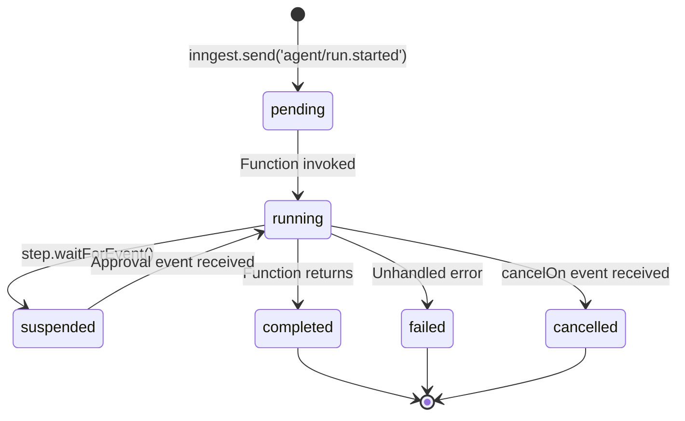
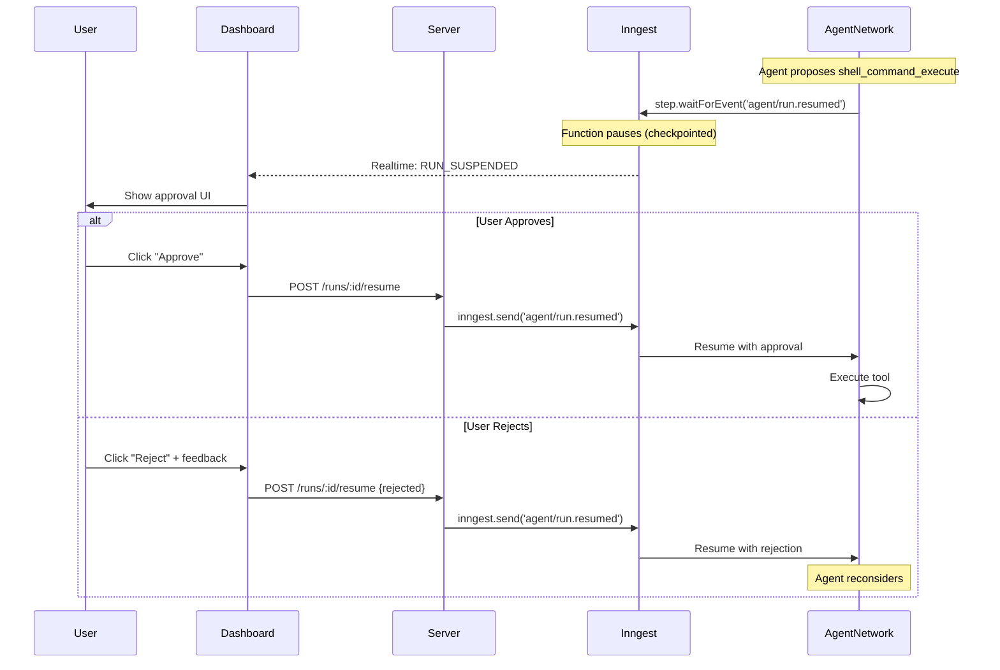

# Agent Architecture

## Overview

This repository demonstrates a **durable ops agent framework** for building autonomous AI agents that can debug code, analyze logs, and orchestrate complex operational tasks. The framework uses **Inngest** for durable execution, **AgentKit** for multi-agent orchestration, and **OpenTelemetry** for comprehensive observability:

- **Durable Execution**: Inngest functions with automatic checkpointing survive server restarts
- **Human-in-the-Loop (HITL)**: `step.waitForEvent()` pauses execution until human approval
- **Multi-Agent Networks**: AgentKit routes tasks to specialized agents with shared state
- **Real-time Streaming**: `useAgent` hook provides WebSocket-based updates to Dashboard
- **Full Observability**: OpenTelemetry traces, Prometheus metrics, Loki logs via Grafana

## System Architecture

```
┌─────────────────────────────────────────────────────────────────────────────┐
│                              Clients                                         │
│  ┌─────────────┐    ┌──────────────────────────────────────────────────┐    │
│  │   ops CLI   │    │              Dashboard (React)                    │    │
│  │ (Terminal)  │    │  useAgent hook + Approval UI                     │    │
│  └──────┬──────┘    └─────────────────────┬────────────────────────────┘    │
│         │                                 │                                  │
│         └───────────────┬─────────────────┘                                  │
│                         │ HTTP + Inngest Realtime (WebSocket)                │
└─────────────────────────┼────────────────────────────────────────────────────┘
                          ▼
┌─────────────────────────────────────────────────────────────────────────────┐
│                        Inngest Platform                                      │
│  ┌────────────────────────────────────────────────────────────────────────┐ │
│  │                    Inngest Dev Server (:8288)                          │ │
│  │  • Durable function execution    • Waterfall trace view               │ │
│  │  • step.run() checkpoints        • Function metrics                   │ │
│  │  • step.waitForEvent() for HITL  • Event inspection                   │ │
│  └────────────────────────────────────────────────────────────────────────┘ │
└─────────────────────────┬────────────────────────────────────────────────────┘
                          │ Events + Function Invocation
                          ▼
┌─────────────────────────────────────────────────────────────────────────────┐
│                     Agent Server (Hono + Inngest)                            │
│  ┌────────────────────────────────────────────────────────────────────────┐ │
│  │                    AgentKit Network                                    │ │
│  │  ┌─────────────┐    ┌─────────────┐    ┌─────────────┐                │ │
│  │  │Orchestrator │───▶│   Coding    │    │Log Analyzer │                │ │
│  │  │   Agent     │───▶│   Agent     │    │   Agent     │                │ │
│  │  └─────────────┘    └─────────────┘    └─────────────┘                │ │
│  │         │                  │                  │                        │ │
│  │         └──────────────────┴──────────────────┘                        │ │
│  │                            │                                           │ │
│  │  ┌─────────────┐    ┌──────▼──────┐    ┌─────────────┐                │ │
│  │  │  Journal    │◀───│   Tools     │───▶│   OTel      │                │ │
│  │  │  Service    │    │ (HITL-aware)│    │   Spans     │                │ │
│  │  │ (Audit Log) │    └─────────────┘    └─────────────┘                │ │
│  └────────────────────────────────────────────────────────────────────────┘ │
└─────────────────────────┬────────────────────────────────────────────────────┘
                          │
        ┌─────────────────┼─────────────────┐
        ▼                 ▼                 ▼
┌───────────────┐  ┌───────────────┐  ┌───────────────┐
│   Bookstore   │  │    Grafana    │  │     OTel      │
│  Application  │  │  (Dashboards) │  │   Collector   │
│  (Target Env) │  │               │  │               │
└───────────────┘  └───────┬───────┘  └───────┬───────┘
                           │                  │
                    ┌──────┴──────┐    ┌──────┴──────┐
                    ▼             ▼    ▼             ▼
              ┌─────────┐  ┌─────────┐  ┌─────────┐
              │  Loki   │  │  Tempo  │  │Prometheus│
              │ (Logs)  │  │(Traces) │  │(Metrics) │
              └─────────┘  └─────────┘  └─────────┘
```

## Core Libraries

### Durable Execution
- **[Inngest](https://www.inngest.com/)** (`inngest`) - Durable function execution with automatic checkpointing
- **[AgentKit](https://agentkit.inngest.com/)** (`@inngest/agent-kit`) - Multi-agent networks with routing
- **[useAgent Hook](https://www.inngest.com/blog/agentkit-useagent-realtime-hook)** (`@inngest/use-agent`) - Real-time React streaming

### Agent Framework
- **[Vercel AI SDK](https://sdk.vercel.ai/)** (`ai`, `@ai-sdk/anthropic`) - LLM orchestration with tool calling
- **[Hono](https://hono.dev/)** - Lightweight HTTP server framework
- **[Zod](https://zod.dev/)** - Type-safe schema validation
- **[Pino](https://getpino.io/)** - Structured logging with OTel correlation

### Observability
- **[OpenTelemetry](https://opentelemetry.io/)** (`@opentelemetry/*`) - Distributed tracing and metrics
- **[Grafana Tempo](https://grafana.com/oss/tempo/)** - Trace storage and visualization
- **[Prometheus](https://prometheus.io/)** - Metrics storage
- **[Loki](https://grafana.com/oss/loki/)** - Log aggregation

### CLI Interface
- **[Ink](https://github.com/vadimdemedes/ink)** - React for CLIs (interactive terminal UI)
- **[Commander](https://github.com/tj/commander.js)** - Command-line argument parsing
- **[Chalk](https://github.com/chalk/chalk)** - Terminal string styling

### Dashboard
- **[React](https://react.dev/)** - UI framework
- **[Tailwind CSS](https://tailwindcss.com/)** - Styling
- **`@inngest/use-agent`** - Real-time agent streaming hook

### Infrastructure
- **Docker Compose** - Service orchestration
- **Traefik** - Reverse proxy and routing
- **PostgreSQL** - Journal persistence
- **Inngest Dev Server** - Local durable execution runtime

---

## Durable Execution with Inngest

The framework uses **Inngest** for durable execution. Each agent run is an Inngest function with automatic checkpointing:

### Why Inngest?

| Feature | Custom DurableLoop | Inngest |
|---------|-------------------|---------|
| Crash recovery | Manual journal replay | Automatic checkpoints |
| HITL approvals | Polling loops | `step.waitForEvent()` |
| State management | Manual projection | Built-in step state |
| Observability | Custom SSE | Waterfall traces |
| Retries | Manual | Configurable per-step |

### Inngest Function Structure

```typescript
import { inngest } from './client';
import { agentNetwork } from './agents';

export const agentRunFunction = inngest.createFunction(
  {
    id: 'agent-run',
    cancelOn: [{ event: 'agent/run.cancelled', match: 'data.runId' }],
  },
  { event: 'agent/run.started' },
  async ({ event, step }) => {
    const { runId, task } = event.data;

    // Each step is checkpointed - survives server restart
    await step.run('init', async () => {
      await journalService.appendEvent(runId, {
        type: 'RUN_STARTED',
        payload: { task },
      });
    });

    // Run the agent network
    const result = await step.run('execute', async () => {
      return agentNetwork.run(task);
    });

    await step.run('complete', async () => {
      await journalService.appendEvent(runId, {
        type: 'RUN_COMPLETED',
        payload: { result },
      });
    });

    return result;
  }
);
```

### Run State Machine



**States**:
| State | Description |
|-------|-------------|
| `pending` | Event sent, function not yet invoked |
| `running` | Inngest function actively executing steps |
| `suspended` | Waiting at `step.waitForEvent()` for approval |
| `completed` | Function returned successfully |
| `failed` | Unrecoverable error occurred |
| `cancelled` | Cancelled via `agent/run.cancelled` event |

### Journal Event Types

The JournalService remains as an **audit log** for compliance and UI display:

| Event Type | Payload | Description |
|------------|---------|-------------|
| `RUN_STARTED` | `{ task, agent_type }` | Agent begins execution |
| `AGENT_THOUGHT` | `{ text_content }` | LLM reasoning output |
| `TOOL_PROPOSED` | `{ tool_name, args, call_id }` | Agent proposes tool call |
| `RUN_SUSPENDED` | `{ tool_name, reason }` | Dangerous tool awaits approval |
| `RUN_RESUMED` | `{ decision, feedback? }` | Human approved/rejected |
| `TOOL_RESULT` | `{ call_id, output_data, status }` | Tool execution result |
| `RUN_COMPLETED` | `{ summary }` | Agent finished |
| `SYSTEM_ERROR` | `{ error_details }` | Fatal error |

---

## Human-in-the-Loop (HITL)

### Tool Classification

Tools are classified as **safe** or **dangerous**:

```typescript
// Dangerous - require human approval
const DANGEROUS_TOOLS = new Set([
  'shell_command_execute',  // Runs arbitrary shell commands
  'write_file',             // Modifies files
  'restart_service',        // Restarts Docker containers
]);

// Safe - execute automatically
const SAFE_TOOLS = new Set([
  'read_file',              // Read-only file access
  'find_files',             // File pattern search
  'search_code',            // Code grep
  'loki_query',             // Log queries (read-only)
]);
```

### HITL with step.waitForEvent()

Inngest's `step.waitForEvent()` provides native HITL support without polling:

```typescript
// Inside an AgentKit tool handler
const askHumanTool = createTool({
  name: 'ask_human',
  description: 'Request human approval for dangerous operations',
  parameters: z.object({
    tool_name: z.string(),
    args: z.any(),
    reason: z.string(),
  }),
  handler: async ({ tool_name, args, reason }, { step }) => {
    // Record suspension in journal
    await journalService.appendEvent(runId, {
      type: 'RUN_SUSPENDED',
      payload: { tool_name, args, reason },
    });

    // Wait for approval (up to 72 hours, no polling!)
    const approval = await step.waitForEvent('agent/run.resumed', {
      match: 'data.runId',
      timeout: '72h',
    });

    // Record decision
    await journalService.appendEvent(runId, {
      type: 'RUN_RESUMED',
      payload: {
        decision: approval?.data.decision || 'timeout',
        feedback: approval?.data.feedback,
      },
    });

    if (!approval || approval.data.decision === 'rejected') {
      return { approved: false, feedback: approval?.data.feedback };
    }

    return { approved: true };
  },
});
```

### Approval Flow



### Resume API

```typescript
runsRouter.post('/:id/resume', async (c) => {
  const { id } = c.req.param();
  const { decision, feedback } = await c.req.json();

  // Send event to resume the waiting step.waitForEvent()
  await inngest.send({
    name: 'agent/run.resumed',
    data: { runId: id, decision, feedback },
  });

  return c.json({ success: true });
});
```

---

## Multi-Agent Orchestration with AgentKit

### AgentKit Networks

Instead of manual child run management, AgentKit Networks handle multi-agent coordination:

```typescript
import { createAgent, createNetwork, anthropic } from '@inngest/agent-kit';

// Define specialized agents
const orchestratorAgent = createAgent({
  name: 'orchestrator',
  description: 'Routes tasks to specialized agents',
  system: orchestratorSystemPrompt,
  model: anthropic({ model: 'claude-sonnet-4-20250514' }),
});

const codingAgent = createAgent({
  name: 'coding',
  description: 'Writes and modifies code',
  system: codingSystemPrompt,
  model: anthropic({ model: 'claude-sonnet-4-20250514' }),
  tools: [shellTool, writeFileTool, readFileTool],
});

const logAnalyzerAgent = createAgent({
  name: 'log-analyzer',
  description: 'Queries and analyzes logs',
  system: logAnalyzerSystemPrompt,
  model: anthropic({ model: 'claude-sonnet-4-20250514' }),
  tools: [lokiQueryTool],
});

// Create network with deterministic routing
const agentNetwork = createNetwork({
  name: 'ops-network',
  agents: [orchestratorAgent, codingAgent, logAnalyzerAgent],
  defaultRouter: ({ lastResult, state, callCount }) => {
    // Max iterations guard
    if (callCount > 20) return undefined;

    // Route based on shared state
    const task = state.get('currentTask');
    if (task?.type === 'coding') return codingAgent;
    if (task?.type === 'logs') return logAnalyzerAgent;

    return orchestratorAgent;
  },
});
```

### Network Routing

```
User Request
     │
     ▼
┌─────────────────┐
│  AgentKit       │
│  Network Router │
└────────┬────────┘
         │
    ┌────┴────┐
    ▼         ▼
┌────────┐ ┌────────────┐
│Coding  │ │Log Analyzer│
│Agent   │ │Agent       │
└────────┘ └────────────┘
    │             │
    └──────┬──────┘
           ▼
    Shared State
```

### Benefits Over Custom Delegation

| Feature | Custom Delegation | AgentKit Networks |
|---------|------------------|-------------------|
| State sharing | Manual via tool returns | Built-in shared state |
| Routing | Hardcoded tools | Configurable router function |
| Tracing | Custom implementation | Single trace for entire network |
| Iteration limits | Manual MAX_STEPS | Built-in callCount |

---

## Real-time Dashboard Streaming

### useAgent Hook

The Dashboard uses `@inngest/use-agent` for real-time updates:

```typescript
import { useAgent } from '@inngest/use-agent';

function AgentRun({ runId }) {
  const { messages, status, sendMessage } = useAgent({
    agentId: 'orchestrator',
    threadId: runId,
  });

  return (
    <div>
      <StatusBadge status={status} />
      <Timeline messages={messages} />
      {status === 'suspended' && (
        <ApprovalCard onApprove={() => sendMessage('approved')} />
      )}
    </div>
  );
}
```

### Dashboard Architecture

| Component | Technology | Purpose |
|-----------|------------|---------|
| **React Dashboard** | `@inngest/use-agent` | HITL approvals, agent progress |
| **Inngest Dev Server** | Built-in UI | Function debugging, waterfall traces |
| **Grafana** | Tempo + Loki + Prometheus | Distributed traces, metrics, logs |

---

## OpenTelemetry Observability

### Telemetry Coverage

| Telemetry Type | Source | Built-in? |
|----------------|--------|-----------|
| **Traces** | | |
| Function execution spans | Inngest | ✅ `extendedTracesMiddleware()` |
| Step execution spans | Inngest | ✅ Each `step.run()` |
| HTTP request spans | OTel | ✅ Auto-instrumentation |
| Database query spans | OTel | ✅ `@opentelemetry/instrumentation-pg` |
| LLM call spans | AgentKit | ✅ `step.ai.infer()` |
| **Metrics** | | |
| Function run counts | Inngest | ✅ In Inngest Dashboard |
| Custom metrics | OTel | ❌ Custom `meter.createCounter()` |
| **Logs** | | |
| Structured logs | Pino | ✅ With trace_id correlation |

### OTel Setup

```typescript
// src/otel/setup.ts - MUST be imported FIRST
import { NodeSDK } from '@opentelemetry/sdk-node';
import { getNodeAutoInstrumentations } from '@opentelemetry/auto-instrumentations-node';
import { OTLPTraceExporter } from '@opentelemetry/exporter-trace-otlp-http';

const sdk = new NodeSDK({
  serviceName: 'agent-server',
  traceExporter: new OTLPTraceExporter({
    url: 'http://otel-collector:4318/v1/traces',
  }),
  instrumentations: [
    getNodeAutoInstrumentations({
      '@opentelemetry/instrumentation-pino': {
        enabled: true,
        logKeys: { traceId: 'trace_id', spanId: 'span_id' },
      },
    }),
  ],
});

sdk.start();
```

### Trace Flow

```
Dashboard Request
       │
       ▼
[Hono API Span] ──────────────────────────────────────────┐
       │                                                   │
       ▼                                                   │
inngest.send('agent/run.started')                         │
       │                                                   │
       ▼                                                   │
[Inngest Function Span] ──────────────────────────────────┤
       │                                                   │
   ┌───┴───┐                                              │
   ▼       ▼                                              │
[step:init] [step:execute] ───────────────────────────────┤
              │                                           │
         ┌────┴────┐                                      │
         ▼         ▼                                      │
   [LLM Span]  [Tool Span] ───────────────────────────────┤
                   │                                      │
                   ▼                                      │
            [HTTP to Store API] ──────────────────────────┤
                   │                                      │
                   ▼                                      │
            [Koa Span in Store API] ──────────────────────┤
                   │                                      │
                   ▼                                      │
            [Postgres Span] ──────────────────────────────┘
                                                          │
                                              All spans in
                                              single trace!
```

---

## Agent Types

### Orchestrator Agent
- **Purpose**: Route tasks to specialized agents
- **Pattern**: Decision tree based on task analysis
- **Network Role**: Entry point, determines agent routing

### Coding Agent
- **Purpose**: Debug and fix code issues
- **Pattern**: ReAct loop (Reasoning → Action → Observation)
- **Tools**: `shell_command_execute`, `read_file`, `write_file`, `find_files`, `search_code`, `restart_service`

### Log Analyzer Agent
- **Purpose**: Query and analyze distributed logs
- **Pattern**: Query → Parse → Analyze → Report
- **Tools**: `loki_query`, `loki_labels`, `loki_service_errors`

---

## Tool Definitions

### Coding Agent Tools

| Tool | Safety | Description |
|------|--------|-------------|
| `shell_command_execute` | DANGEROUS | Execute shell commands (allowlist-validated) |
| `read_file` | SAFE | Read file contents |
| `write_file` | DANGEROUS | Overwrite entire file |
| `find_files` | SAFE | Find files by glob pattern |
| `search_code` | SAFE | Regex search in codebase |
| `restart_service` | DANGEROUS | Restart Docker containers |

### Log Query Tools

| Tool | Safety | Description |
|------|--------|-------------|
| `loki_query` | SAFE | Execute LogQL queries |
| `loki_labels` | SAFE | Get available label values |
| `loki_service_errors` | SAFE | Query error logs by service |

### Security Controls

**Shell Command Allowlist**:
```typescript
const ALLOWED_COMMANDS = ['cat', 'node', 'tsx', 'npm', 'echo', 'ls', 'pwd', 'mkdir', 'test'];

// Commands are spawned without shell evaluation
spawn(program, args, { shell: false });  // Prevents injection
```

---

## API Endpoints

### Run Management

| Method | Endpoint | Description |
|--------|----------|-------------|
| `POST` | `/runs` | Create run, sends `agent/run.started` event |
| `GET` | `/runs/:id` | Get run status and metadata |
| `POST` | `/runs/:id/resume` | Send `agent/run.resumed` event |
| `POST` | `/runs/:id/cancel` | Send `agent/run.cancelled` event |
| `GET` | `/runs` | List all runs |

### Inngest Integration

| Method | Endpoint | Description |
|--------|----------|-------------|
| `*` | `/api/inngest` | Inngest serve handler (events + functions) |

### Health & Observability

| Method | Endpoint | Description |
|--------|----------|-------------|
| `GET` | `/health` | Server health check |
| `GET` | `/metrics` | Prometheus metrics endpoint |

---

## Configuration

### Environment Variables

```bash
# Inngest
INNGEST_DEV=1
INNGEST_BASE_URL=http://inngest:8288
INNGEST_EVENT_KEY=local

# OpenTelemetry
OTEL_EXPORTER_OTLP_ENDPOINT=http://otel-collector:4318
OTEL_SERVICE_NAME=agent-server
OTEL_TRACES_SAMPLER=always_on

# Application
WORK_DIR=/workspace
LOKI_URL=http://loki:3100
DATABASE_URL=postgresql://...
AUTH_USERNAME=admin
AUTH_PASSWORD=secret
```

---

## Error Handling

1. **Tool execution errors** → Recorded as `TOOL_RESULT` with `status: 'error'`
2. **LLM API errors** → Inngest retries with exponential backoff
3. **Approval timeout** → `step.waitForEvent()` returns null after timeout
4. **Server crash** → Inngest resumes from last checkpoint automatically
5. **Cancellation** → `cancelOn` event terminates function gracefully

---

## Security Considerations

- **Path traversal prevention** in file tools
- **Workspace isolation** per agent
- **Command allowlisting** for shell execution
- **HITL gates** for all dangerous operations
- **No direct database access** from agents
- **Basic auth** for API access
- **Shell-less spawning** prevents command injection
- **Inngest event signing** in production

---

## Monitoring & Observability

### Three-Pillar Observability

| Pillar | Technology | Access |
|--------|------------|--------|
| **Traces** | Tempo | http://grafana.localhost → Explore → Tempo |
| **Metrics** | Prometheus | http://grafana.localhost → Explore → Prometheus |
| **Logs** | Loki | http://grafana.localhost → Explore → Loki |

### Key Dashboards

1. **Agent Command Center**: Active runs, service map, recent traces
2. **LLM Performance**: Token usage, latency histograms, cost estimation
3. **HITL Analytics**: Approval rates, wait times, tool frequency
4. **Inngest Dev Server**: Function waterfall, step debugging (http://inngest.localhost)

### Log Correlation

Logs automatically include `trace_id` and `span_id` for correlation:
```json
{
  "level": "info",
  "msg": "Tool executed",
  "trace_id": "abc123...",
  "span_id": "def456...",
  "tool": "write_file"
}
```

Click any log entry in Grafana to jump to the full distributed trace.

---

## Extensibility

### Adding a New Agent to the Network

```typescript
const myAgent = createAgent({
  name: 'my-agent',
  description: 'Does something specialized',
  system: mySystemPrompt,
  model: anthropic({ model: 'claude-sonnet-4-20250514' }),
  tools: [myTool1, myTool2],
});

// Add to network
const network = createNetwork({
  agents: [...existingAgents, myAgent],
  defaultRouter: ({ state }) => {
    if (state.get('needsMyAgent')) return myAgent;
    // ... existing routing
  },
});
```

### Adding a New Dangerous Tool

1. Create tool with AgentKit `createTool()`
2. Add to agent's tool list
3. Implement HITL check in tool handler using `step.waitForEvent()`
4. The tool will automatically pause for approval

---

## Testing Strategy

### Test Architecture

```
┌─────────────────────────────────────────────────────────────┐
│                    docker-compose.test.yaml                  │
│  ┌─────────────┐    ┌─────────────┐    ┌─────────────┐      │
│  │  Playwright │    │ Agent Server│    │ Mock LLM    │      │
│  │  (Browser)  │───▶│  (Test Mode)│───▶│  Server     │      │
│  └─────────────┘    └──────┬──────┘    │  (:3333)    │      │
│                            │           └─────────────┘      │
│  ┌─────────────┐    ┌──────▼──────┐    ┌─────────────┐      │
│  │  API Tests  │───▶│   Inngest   │    │  Test DB    │      │
│  │  (Jest)     │    │  Dev Server │    │ (Postgres)  │      │
│  └─────────────┘    └─────────────┘    └─────────────┘      │
└─────────────────────────────────────────────────────────────┘
```

### Test Pyramid

| Layer | Technology | Scope | LLM Mocked? |
|-------|------------|-------|-------------|
| **Unit** | Jest | Pure functions, utilities | Yes (mocked) |
| **Integration** | Jest | HITL flow, journal writes | Yes (mocked) |
| **Backend E2E** | Jest + Supertest | Full API flows | Yes (mock server) |
| **Browser E2E** | Playwright | Dashboard UI | Yes (mock server) |

### E2E Test Coverage

| User Flow | API Test | UI Test | HITL? |
|-----------|----------|---------|-------|
| Create run | ✅ | ✅ | N/A |
| View run progress | ✅ | ✅ | N/A |
| Approve dangerous tool | ✅ | ✅ | Yes |
| Reject dangerous tool | ✅ | ✅ | Yes |
| Cancel run | ✅ | ✅ | N/A |
| Server restart recovery | ✅ | - | Yes |

### Mock LLM Server

Deterministic LLM responses for reproducible tests:

| Fixture | Behavior |
|---------|----------|
| `safe-read-file.json` | Returns read_file tool call |
| `dangerous-shell.json` | Returns shell_command_execute (triggers HITL) |
| `completion-after-tool.json` | Returns completion text |
| `acknowledge-rejection.json` | Acknowledges rejection feedback |

See [TESTING.md](ops/packages/agent-server/TESTING.md) for full documentation.

---

## Infrastructure Services

| Service | Port | URL | Purpose |
|---------|------|-----|---------||
| Agent Server | 3200 | http://api.localhost/agents | Agent API |
| Inngest Dev Server | 8288 | http://inngest.localhost | Function execution |
| Grafana | 3000 | http://grafana.localhost | Observability UI |
| Tempo | 3200 | http://tempo.localhost | Trace storage |
| Mock LLM Server | 3333 | http://mock-llm:3333 | Deterministic LLM for tests |
| Prometheus | 9090 | http://prometheus.localhost | Metrics storage |
| Loki | 3100 | http://loki.localhost | Log aggregation |
| OTel Collector | 4317/4318 | - | Telemetry routing |
| Traefik | 80/8080 | http://localhost:8080 | Reverse proxy |
