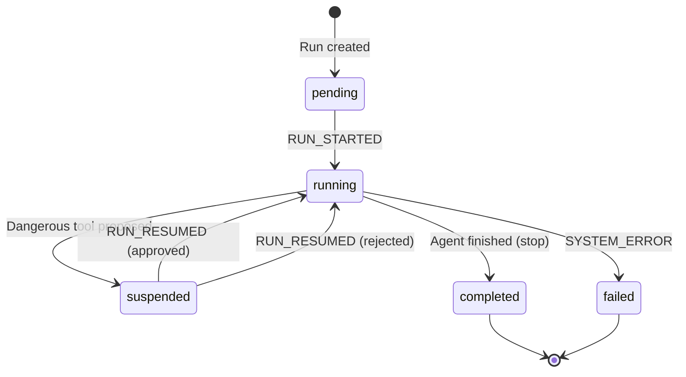
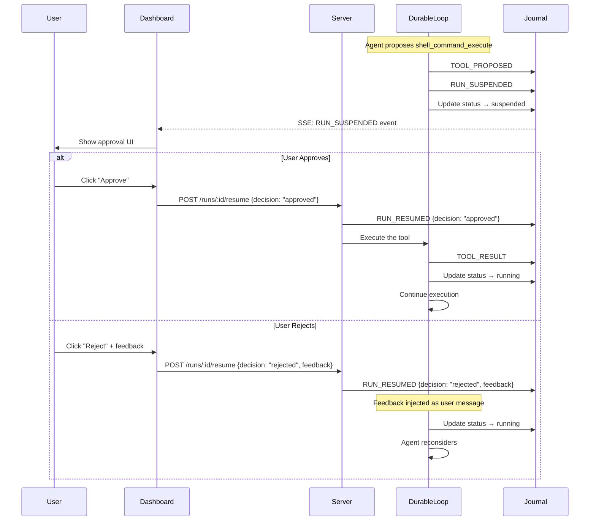
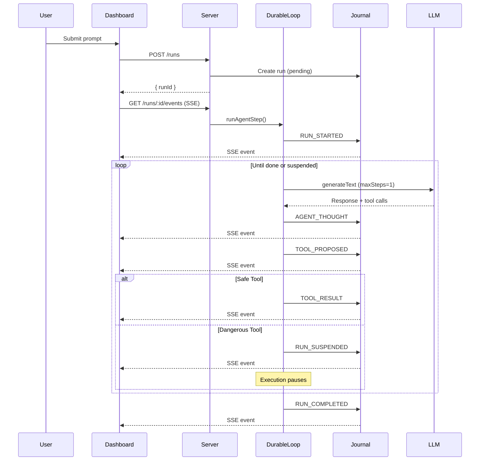

# Agent Architecture

## Overview

This repository demonstrates a **durable ops agent framework** for building autonomous AI agents that can debug code, analyze logs, and orchestrate complex operational tasks. The framework uses an **event-sourced architecture** with:

- **Durable Runs**: All agent state is derived from an append-only event journal, enabling crash recovery and full auditability
- **Human-in-the-Loop (HITL)**: Dangerous operations suspend execution until human approval
- **Real-time Event Streaming**: Server-Sent Events (SSE) push updates to CLI and Dashboard clients
- **Multi-Agent Orchestration**: An orchestrator routes tasks to specialized sub-agents

## System Architecture

```
┌─────────────────────────────────────────────────────────────────┐
│                        Clients                                   │
│  ┌─────────────┐    ┌─────────────────────────────────────┐     │
│  │   ops CLI   │    │           Dashboard                  │     │
│  │ (Terminal)  │    │  (React + Approval UI)              │     │
│  └──────┬──────┘    └────────────────┬────────────────────┘     │
│         │                            │                           │
│         └────────────┬───────────────┘                           │
│                      │ HTTP + SSE                                │
└──────────────────────┼───────────────────────────────────────────┘
                       ▼
┌──────────────────────────────────────────────────────────────────┐
│                     Agent Server (Hono)                          │
│  ┌────────────────────────────────────────────────────────────┐  │
│  │                    DurableLoop                              │  │
│  │  ┌─────────┐    ┌─────────────┐    ┌──────────────────┐    │  │
│  │  │ Journal │◀──▶│ State       │◀──▶│ Tool Executor    │    │  │
│  │  │ Service │    │ Machine     │    │ (Safe/Dangerous) │    │  │
│  │  └─────────┘    └─────────────┘    └──────────────────┘    │  │
│  └────────────────────────────────────────────────────────────┘  │
│                           │                                       │
│      ┌────────────────────┼────────────────────┐                 │
│      ▼                    ▼                    ▼                 │
│  ┌─────────┐        ┌───────────┐       ┌────────────┐          │
│  │ Coding  │        │Log        │       │ Loki/      │          │
│  │ Agent   │        │Analyzer   │       │ Grafana    │          │
│  └────┬────┘        └─────┬─────┘       └──────┬─────┘          │
└───────┼───────────────────┼────────────────────┼─────────────────┘
        │                   │                    │
        ▼                   ▼                    ▼
┌──────────────────────────────────────────────────────────────────┐
│              Bookstore Application                                │
│              (Services + Databases + Logs)                        │
└──────────────────────────────────────────────────────────────────┘
```

## Core Libraries

### Agent Framework
- **[Vercel AI SDK](https://sdk.vercel.ai/)** (`ai`, `@ai-sdk/anthropic`) - LLM orchestration with tool calling
- **[Hono](https://hono.dev/)** - Lightweight HTTP server framework
- **[Zod](https://zod.dev/)** - Type-safe schema validation
- **[Pino](https://getpino.io/)** - Structured logging
- **[TypeORM](https://typeorm.io/)** - Database ORM for journal persistence

### CLI Interface
- **[Ink](https://github.com/vadimdemedes/ink)** - React for CLIs (interactive terminal UI)
- **[Commander](https://github.com/tj/commander.js)** - Command-line argument parsing
- **[Chalk](https://github.com/chalk/chalk)** - Terminal string styling

### Dashboard
- **[React](https://react.dev/)** - UI framework
- **[Tailwind CSS](https://tailwindcss.com/)** - Styling
- **EventSource API** - SSE consumption

### Infrastructure
- **Docker Compose** - Service orchestration
- **Traefik** - Reverse proxy and routing
- **Loki** - Log aggregation
- **Grafana** - Log visualization
- **PostgreSQL** - Journal persistence

---

## Durable Run Architecture

The framework implements an **event-sourced** design where all agent state is derived from an append-only journal. This enables:

1. **Crash Recovery**: Runs can resume after server restart
2. **Full Auditability**: Complete history of agent actions
3. **Human-in-the-Loop**: Dangerous operations suspend until approved

### Run State Machine



**States**:
| State | Description |
|-------|-------------|
| `pending` | Run created, not yet started |
| `running` | Agent actively executing steps |
| `suspended` | Waiting for human approval of dangerous tool |
| `completed` | Agent finished successfully |
| `failed` | Unrecoverable error occurred |

### Journal Event Types

All state changes are recorded as typed events in the journal:

| Event Type | Payload | Description |
|------------|---------|-------------|
| `RUN_STARTED` | `{ prompt, user_id }` | Agent begins execution |
| `AGENT_THOUGHT` | `{ text_content }` | LLM reasoning output |
| `TOOL_PROPOSED` | `{ tool_name, args, call_id }` | Agent proposes tool call |
| `RUN_SUSPENDED` | `{ reason }` | Dangerous tool awaits approval |
| `RUN_RESUMED` | `{ decision, feedback? }` | Human approved/rejected |
| `TOOL_RESULT` | `{ call_id, output_data, status }` | Tool execution result |
| `RUN_COMPLETED` | `{ summary }` | Agent finished |
| `SYSTEM_ERROR` | `{ error_details }` | Fatal error |

### The DurableLoop

The core execution engine (`DurableLoop.ts`) implements single-step execution for durability:

```typescript
// Execute exactly ONE LLM step at a time
const result = await generateText({
  model: anthropic('claude-sonnet-4-20250514'),
  maxSteps: 1,  // KEY: Single step for crash recovery
  system: getCodingSystemPrompt(),
  messages,
  tools: preparedTools,
});
```

**Why `maxSteps: 1`?**
- After each step, state is persisted to the journal
- If the server crashes, the run resumes from the last recorded event
- No in-memory state is lost

### Message Projection

The `projectToPrompt()` function reconstructs LLM conversation history from journal events:

```
Journal Events → projectToPrompt() → CoreMessage[]
     │                                      │
     │  RUN_STARTED                         │  user: "Fix the bug"
     │  AGENT_THOUGHT                       │  assistant: "I'll check..."
     │  TOOL_PROPOSED                       │  assistant: [tool_call]
     │  TOOL_RESULT                         │  tool: [result]
     └──────────────────────────────────────┘
```

---

## Human-in-the-Loop (HITL)

### Tool Classification

Tools are classified as **safe** or **dangerous**:

```typescript
// Dangerous - require human approval
const DANGEROUS_TOOLS = new Set([
  'shell_command_execute',  // Runs arbitrary shell commands
  'write_file',             // Modifies files
  'restart_service',        // Restarts Docker containers
]);

// Safe - execute automatically
const SAFE_TOOLS = new Set([
  'read_file',              // Read-only file access
  'find_files',             // File pattern search
  'search_code',            // Code grep
  'loki_query',             // Log queries (read-only)
  'loki_labels',            // Loki metadata
  'loki_service_errors',    // Error log queries
]);
```

### The Tool Stripping Pattern

The `execute` function is stripped from ALL tools before passing to the LLM. This prevents the Vercel AI SDK from auto-executing tools and gives us control over event ordering:

```typescript
const executeFunctions = new Map<string, Function>();

for (const [name, tool] of Object.entries(allTools)) {
  // Save execute function for manual execution later
  if (typeof tool.execute === 'function') {
    executeFunctions.set(name, tool.execute);
  }
  // Strip execute from ALL tools
  const { execute, ...rest } = tool;
  preparedTools[name] = rest;
}
```

This allows us to:
1. Record `TOOL_PROPOSED` before any execution happens
2. Check if the tool is dangerous and suspend if needed
3. Execute safe tools manually from the stored function map
4. Execute dangerous tools only after human approval

### Approval Flow



### Dashboard Approval UI

The Dashboard displays an inline approval component when a run is suspended:

- Orange highlight indicating danger
- Tool name and arguments displayed
- Optional feedback field for rejections
- Approve (green) / Reject (red) buttons

---

## Event-Driven Architecture

### Event Flow



### Server-Sent Events (SSE) Streaming

Real-time updates are delivered via SSE with **push-based architecture** (no polling):

**Endpoint**: `GET /runs/:id/events`

**Implementation** (EventEmitter pub/sub):
```typescript
return streamSSE(c, async (stream) => {
  const subscribedRuns = new Set<string>();
  const unsubscribers = new Map<string, () => void>();

  async function subscribeToRun(runId: string) {
    if (subscribedRuns.has(runId)) return;
    subscribedRuns.add(runId);

    // Subscribe FIRST to capture events during fetch
    const unsub = journalService.subscribe(runId, (event) => {
      stream.writeSSE({ data: JSON.stringify(event), event: 'event' });
      // Recursively subscribe to child runs
      if (event.type === 'CHILD_RUN_STARTED') {
        subscribeToRun(event.payload.child_run_id);
      }
    });
    unsubscribers.set(runId, unsub);

    // Send existing events
    const events = await journalService.getEvents(runId);
    for (const event of events) {
      stream.writeSSE({ data: JSON.stringify(event), event: 'event' });
      if (event.type === 'CHILD_RUN_STARTED') {
        await subscribeToRun(event.payload.child_run_id);
      }
    }
  }

  await subscribeToRun(runId);

  // Cleanup on disconnect
  stream.onAbort(() => {
    for (const unsub of unsubscribers.values()) unsub();
  });
});
```

**Push Architecture Benefits**:
- **Zero latency**: Events pushed immediately when appended to journal
- **Single connection**: Parent + all child run events stream through one SSE
- **No polling**: EventEmitter pub/sub eliminates database polling
- **Efficient cleanup**: Subscriptions properly tracked and removed on disconnect

---

## Multi-Agent Orchestration

### The Orchestrator Pattern

The **Orchestration Agent** routes tasks to specialized sub-agents:

```
User Request
     │
     ▼
Orchestration Agent
     │
     ├─→ "Fix bug" ──────────────→ Coding Agent
     ├─→ "Check logs" ────────────→ Log Analyzer Agent
     └─→ "Fix and verify" ────────→ Both (sequential/parallel)
```

### Agent Isolation

Each sub-agent:
- Runs in its own instance (fresh creation)
- Has its own event emitter with unique ID
- Returns results via tool return value (synchronous)
- Is shut down after completion

```typescript
execute: async ({ task }) => {
  const agent = await createCodingAgent(config);
  const result = await agent.run(task);  // Returns AgentResult
  await agent.shutdown();
  return result;  // Passed back to orchestrator
}
```

**No cross-agent event contamination**: Sub-agents don't emit events to the same journal. They return structured results that the orchestrator interprets.

### Execution Modes

- **Sequential**: `await codingAgent.run()` then `await logAgent.run()`
- **Parallel**: `Promise.all([codingAgent.run(), logAgent.run()])`

---

## Agent Types

### Coding Agent
- **Purpose**: Debug and fix code issues
- **Pattern**: ReAct loop (Reasoning → Action → Observation)
- **Tools**: `shell_command_execute`, `read_file`, `write_file`, `find_files`, `search_code`, `restart_service`

### Log Analyzer Agent
- **Purpose**: Query and analyze distributed logs
- **Pattern**: Query → Parse → Analyze → Report
- **Tools**: `loki_query`, `loki_labels`, `loki_service_errors`

### Orchestration Agent
- **Purpose**: Route tasks to specialized agents
- **Pattern**: Decision tree based on task analysis
- **Tools**: `run_coding_agent`, `run_log_analyzer_agent`, `run_both_agents`

---

## Tool Definitions

### Coding Agent Tools

| Tool | Safety | Description |
|------|--------|-------------|
| `shell_command_execute` | DANGEROUS | Execute shell commands (allowlist-validated) |
| `read_file` | SAFE | Read file contents |
| `write_file` | DANGEROUS | Overwrite entire file |
| `find_files` | SAFE | Find files by glob pattern |
| `search_code` | SAFE | Regex search in codebase |
| `restart_service` | DANGEROUS | Restart Docker containers |

### Log Query Tools

| Tool | Safety | Description |
|------|--------|-------------|
| `loki_query` | SAFE | Execute LogQL queries |
| `loki_labels` | SAFE | Get available label values |
| `loki_service_errors` | SAFE | Query error logs by service |

### Security Controls

**Shell Command Allowlist**:
```typescript
const ALLOWED_COMMANDS = ['cat', 'node', 'tsx', 'npm', 'echo', 'ls', 'pwd', 'mkdir', 'test'];

// Commands are spawned without shell evaluation
spawn(program, args, { shell: false });  // Prevents injection
```

**Restartable Services Allowlist**:
```typescript
const RESTARTABLE_SERVICES = ['store-api', 'warehouse-alpha', 'warehouse-beta', 'bookstore-ui'];
```

---

## API Endpoints

### Run Management

| Method | Endpoint | Description |
|--------|----------|-------------|
| `POST` | `/runs` | Create and start a new run |
| `GET` | `/runs/:id` | Get run status and metadata |
| `GET` | `/runs/:id/events` | SSE stream of journal events |
| `POST` | `/runs/:id/resume` | Resume a suspended run |
| `GET` | `/runs` | List all runs |

### Legacy Agent Endpoints

| Method | Endpoint | Description |
|--------|----------|-------------|
| `POST` | `/agents/coding/run` | Run coding agent (non-durable) |
| `POST` | `/agents/log-analyzer/run` | Run log analyzer (non-durable) |
| `POST` | `/agents/orchestration/run` | Run orchestrator (non-durable) |
| `GET` | `/agents/types` | List available agents |
| `GET` | `/health` | Server health check |

### Authentication

HTTP Basic Auth for all endpoints:
- Username: `AUTH_USERNAME` (default: admin)
- Password: `AUTH_PASSWORD` (required in `.env`)

---

## Configuration

```typescript
interface AgentConfig {
  agentType: string;        // Agent identifier
  model: string;            // LLM model (e.g., 'claude-sonnet-4')
  maxSteps: number;         // Max reasoning steps
  workDir: string;          // Working directory
  logLevel: 'debug' | 'info' | 'error';
}
```

Environment Variables:
- `WORK_DIR` - Agent working directory
- `LOKI_URL` - Loki server URL for log queries
- `AUTH_USERNAME` / `AUTH_PASSWORD` - API authentication
- `DATABASE_URL` - PostgreSQL connection string

---

## Error Handling

1. **Tool execution errors** → Recorded as `TOOL_RESULT` with `status: 'error'`
2. **LLM API errors** → Recorded as `SYSTEM_ERROR`, run marked `failed`
3. **Approval timeout** → Run stays `suspended` indefinitely (no timeout)
4. **Server crash** → Run resumes from last journal event on restart

---

## Security Considerations

- **Path traversal prevention** in file tools
- **Workspace isolation** per agent
- **Command allowlisting** for shell execution
- **Tool stripping** prevents auto-execution of dangerous operations
- **No direct database access** from agents
- **Basic auth** for API access
- **Shell-less spawning** prevents command injection

---

## Monitoring & Observability

- **Agent Logs**: Pino structured JSON logs
- **Application Logs**: Loki aggregation from all services
- **Event Journal**: Complete history of all agent actions
- **Dashboard Timeline**: Visual event stream with color-coded types
- **Raw Event View**: Collapsible JSON for debugging

---

## Extensibility

### Adding a New Agent

1. **Create agent class** extending `BaseAgent`:
```typescript
export class MyAgent extends BaseAgent {
  async initialize(): Promise<void> { /* setup */ }
  async run(task: string): Promise<AgentResult> { /* execute */ }
  async shutdown(): Promise<void> { /* cleanup */ }
}
```

2. **Define tools**:
```typescript
const myTool = tool({
  description: "My tool",
  parameters: z.object({ input: z.string() }),
  execute: async ({ input }) => { /* ... */ }
});
```

3. **Register in DurableLoop** (for durable runs) or server routes (for non-durable).

### Adding a New Dangerous Tool

1. Add tool name to `DANGEROUS_TOOLS` set in `journal.ts`
2. Create tool with `execute` function
3. The DurableLoop will automatically strip `execute` and require approval

---

## Future Enhancements

- **Agent Memory**: Persist conversation history across runs
- **Tool Caching**: Cache expensive read operations
- **Rate Limiting**: Prevent runaway agents
- **Multi-tenancy**: Isolated workspaces per user
- **Agent Pools**: Concurrent agent execution
- **Approval Policies**: Auto-approve based on rules
- **Timeout Handling**: Configurable approval timeouts
