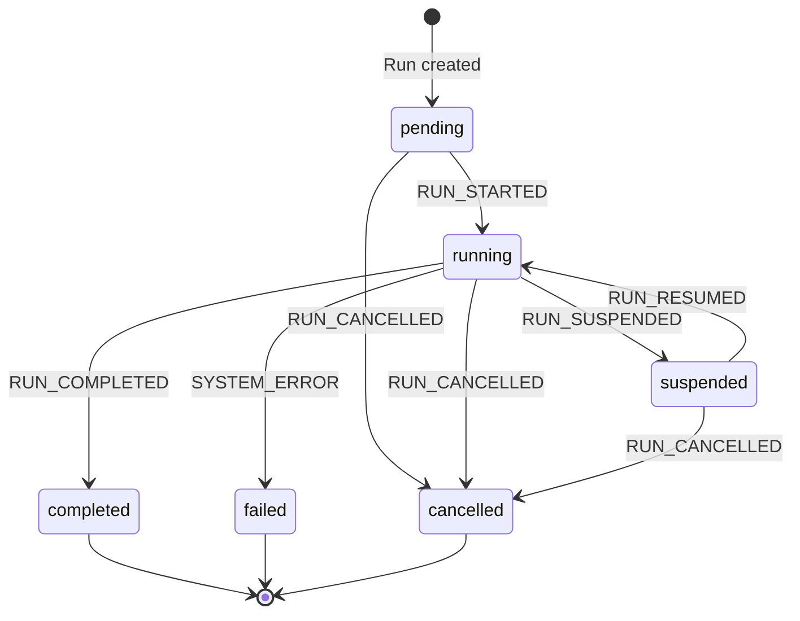

# Building Durable AI Agents: Event Sourcing, State Machines, and Humans in the Middle

*What if AI agents could pause mid-task, wait for human approval, and resume exactly where they left off—even after a server crash?*

---

Building on my [previous ops agent project](https://tonyfoster.dev/building-an-ai-ops-agent), I wanted to solve two fundamental problems.

**Problem A: Unsupervised Agents Are Dangerous**

My ops agent framework gives agents real power—they can execute shell commands and modify files. This is useful; an agent can genuinely debug and fix issues. But some of these calls are dangerous. An agent might run `rm -rf` on the wrong directory, or make a "fix" that breaks things worse.

The agent is acting unsupervised. It has no concept of "wait, let me think about this more carefully."

The obvious solution is confirmation dialogs—ask the human before doing anything dangerous. But traditional confirmation dialogs have a problem: if you wait hours for approval, or the server restarts, you lose all context. The agent forgets what it was doing.

I needed agents that could *propose* dangerous actions, *pause* for human review, and *resume* seamlessly after approval—without losing state.

**Problem B: Agent Execution State Is Ephemeral**

In my previous agent, execution state lived in memory. The agent would query logs, read files, and propose a fix—but if the server restarted while waiting for approval, that pending tool call was gone. It was just a variable in the running process.

For operational tasks, I needed that execution state persisted.

**Problem C: No Audit Trail**

When agents execute tools autonomously, you need to know what happened. My previous agent had no record of what it did or why. If something went wrong, I couldn't trace the agent's reasoning or actions.

The answer required combining three patterns: **event sourcing** for durability and auditability, a **state machine** for control flow, and **human-in-the-loop** for safety.

---

## An Example

Before diving into implementation, here's what human-in-the-loop looks like in practice:

**1. User submits**: "The store-api is returning 500 errors. Fix it."

**2. Orchestrator delegates** to log analyzer agent

**3. Log analyzer** queries Loki, finds error in `bookService.ts:12`

**4. Orchestrator delegates** to coding agent with specific file

**5. Coding agent** reads file, proposes fix via `write_file`

**6. Run suspends** for human approval

**7. Human reviews** the diff, clicks "Approve"

**8. File written**, run completes with summary


The agents handled investigation, analysis, and solution design. The human just validated the file write.

This is the core idea: instead of fully automated execution, the agent pauses before dangerous operations and waits for human judgment. The agent does the tedious work; humans make the high-stakes decisions.

---

## Durability

My previous agent kept everything in memory—it couldn't safely suspend or recover from service interruptions:

- Voluntary interruptions (waiting for approval) or involuntary ones (server restarts) cause the agent to lose its place
- Complex work across multiple agents can't be coordinated

I needed execution state persisted so the agent could pause, wait, and resume.

---

## Event Sourcing

Event sourcing solves all three problems at once. Instead of storing current state, you store every action as an immutable event in a journal:

- **HITL**: Record the proposed tool call as an event. The agent can suspend, wait for approval, and resume by replaying the journal.
- **Durability**: Server restarts? Replay the events to reconstruct exactly where the agent left off.
- **Auditability**: The journal is a complete history of everything the agent did.

### Event Types

A run is modeled as a sequence of events. Each significant action gets its own event type:

| Event Type | Description |
|------------|-------------|
| `RUN_STARTED` | Agent begins processing |
| `AGENT_THOUGHT` | LLM reasoning text |
| `TOOL_PROPOSED` | Agent proposes an action |
| `RUN_SUSPENDED` | Waiting for human |
| `RUN_RESUMED` | Human decision recorded |
| `TOOL_RESULT` | Action outcome |
| `CHILD_RUN_STARTED` | Orchestrator delegates |
| `CHILD_RUN_COMPLETED` | Sub-agent finished |
| `RUN_COMPLETED` / `RUN_CANCELLED` / `SYSTEM_ERROR` | Terminal states |

### State Machine

Every agent run follows a state machine:



Six states, clear transitions. The `suspended` state is where human oversight lives—the agent waits here until the user approves or rejects the proposed action.

Events drive state transitions. When we record `RUN_SUSPENDED`, the run moves to `suspended`. When we record `RUN_RESUMED`, it moves back to `running`. The state machine defines valid transitions, but events are the source of truth.

### The Event Journal

Events are stored in an append-only journal. Here's what a typical run looks like:

| Seq | Event Type | Payload |
|-----|------------|---------|
| 1 | `RUN_STARTED` | `{ prompt: "Fix the bug" }` |
| 2 | `AGENT_THOUGHT` | `{ text: "I'll check the logs..." }` |
| 3 | `TOOL_PROPOSED` | `{ tool: "write_file", args: {...} }` |
| 4 | `RUN_SUSPENDED` | `{ reason: "Dangerous tool" }` |
| | *— waiting for human —* | |
| 5 | `RUN_RESUMED` | `{ decision: "approved" }` |
| 6 | `TOOL_RESULT` | `{ output: "File written" }` |
| 7 | `RUN_COMPLETED` | `{ summary: "Fixed the bug" }` |

The journal is the single source of truth. To reconstruct current state or resume after a crash, replay the events.

---

## Achieving Durability: The Implementation

### Storing Events in the Journal

The journal is a SQLite database with an append-only `journal_entries` table:

```typescript
// Each event stored with:
{
  id: string;           // UUID
  run_id: string;       // Which agent run
  sequence: number;     // Order within run
  event_type: string;   // RUN_STARTED, TOOL_PROPOSED, etc.
  payload: object;      // Event-specific data
  created_at: datetime; // When it happened
}
```

### Single-Step Execution

Here's where it gets interesting. The core execution engine—the DurableLoop—has one crucial constraint:

```typescript
const result = await generateText({
  model: anthropic('claude-sonnet-4-20250514'),
  maxSteps: 1,  // Execute exactly ONE step
  system: getSystemPrompt(),
  messages,
  tools: preparedTools,
});
```

**`maxSteps: 1`**. This is the key to durability.

After every single LLM interaction, we persist state to the journal. If the server crashes, we lose nothing—just replay the journal and pick up where we left off.

### HITL via Tool Stripping

We can't let the LLM auto-execute dangerous tools. But we also need to control event ordering for ALL tools. The solution: strip the `execute` function from every tool.

```typescript
const executeFunctions = new Map<string, Function>();

for (const [name, tool] of Object.entries(allTools)) {
  // Save execute function for later
  if (typeof tool.execute === 'function') {
    executeFunctions.set(name, tool.execute);
  }
  // Strip execute from ALL tools
  const { execute, ...rest } = tool;
  preparedTools[name] = rest;
}
```

Why ALL tools, not just dangerous ones? This ensures `TOOL_PROPOSED` is always recorded before any execution happens. The LLM sees the tool, proposes using it, but can't execute it. We control execution timing.

After recording `TOOL_PROPOSED`:
- **Safe tools**: Execute immediately from the Map, record `TOOL_RESULT`
- **Dangerous tools**: Record `RUN_SUSPENDED`, wait for human

On approval:
1. Look up stored execute function from the Map
2. Execute the tool
3. Record `TOOL_RESULT`
4. Continue the loop

### Parent-Child Agent Coordination

The orchestrator delegates to specialized sub-agents. When a child needs approval, both runs coordinate:

```typescript
// When child suspends, parent also suspends
await journalService.appendEvent(parentRunId, {
  type: 'RUN_SUSPENDED',
  payload: {
    reason: 'Waiting for child run approval',
    blocked_by_child_run_id: childRunId,
  },
});
```

When the user approves on the parent's dashboard, we check if we're blocked by a child:

```typescript
// Check if suspended due to child needing HITL
const lastSuspended = [...events].reverse().find(
  e => e.event_type === 'RUN_SUSPENDED'
);

if (lastSuspended?.payload.blocked_by_child_run_id) {
  // Forward resume to child run
  await resumeRun(lastSuspended.payload.blocked_by_child_run_id, decision);
  return;
}
```

The flow:
1. Child proposes dangerous tool → child suspends
2. Parent also suspends (blocked by child)
3. User approves on parent → approval forwards to child
4. Child executes, completes → parent resumes

### Message Reconstruction

After resume, we rebuild the LLM conversation from events. The `projectToPrompt()` function is essentially an event projection:

```typescript
function projectToPrompt(events, originalPrompt): CoreMessage[] {
  const messages = [{ role: 'user', content: originalPrompt }];

  for (const event of events) {
    switch (event.event_type) {
      case 'AGENT_THOUGHT':
        // Becomes assistant message with text
        break;
      case 'TOOL_PROPOSED':
        // Becomes tool_call in assistant message
        break;
      case 'TOOL_RESULT':
        // Becomes tool result message
        break;
      case 'RUN_RESUMED':
        // Rejection feedback becomes user message
        if (payload.decision === 'rejected') {
          messages.push({
            role: 'user',
            content: `Rejected: ${payload.feedback}`
          });
        }
        break;
    }
  }
  return messages;
}
```

This is where event sourcing shines—the same mechanism handles:
- Resuming after HITL approval
- Recovering after server crash

---

## Real-Time Event Streaming

How does the Dashboard know when to show the approval UI? Server-Sent Events (SSE) with push-based architecture.

```typescript
// JournalService is an EventEmitter
class JournalService extends EventEmitter {
  async appendEvent(runId, event) {
    // Persist to database
    await this.db.insert(event);
    // Emit for any subscribers
    this.emit(`run:${runId}`, event);
  }
}
```

The SSE endpoint subscribes to events as they're written:

```typescript
journalService.subscribe(runId, (event) => {
  stream.writeSSE({ data: JSON.stringify(event), event: 'event' });

  // Recursively subscribe to child runs
  if (event.type === 'CHILD_RUN_STARTED') {
    subscribeToRun(event.payload.child_run_id);
  }
});
```

No polling. Events stream immediately when written to the journal. Parent and child run events flow through a single SSE connection.

---

## Limitations & Caveats

### Tool Idempotency

This architecture doesn't guarantee complete durability in all cases. If a crash occurs mid-tool-execution:
1. The tool executes
2. Server crashes
3. On restart, we replay events
4. Tool may re-execute

Tools must be written with care for idempotent replay:
- `write_file` is safe to replay (same content, same result)
- `send_email` is NOT safe (duplicate emails)

This is true of ALL event-sourced systems. The solution is idempotency keys at the tool level—not something I implemented here.

### The Dual Write Problem

Journal events aren't 100% accurate under disruption. If the server crashes after tool execution but before the event is recorded, the journal is incomplete.

For this application—dashboard visualization and HITL—that's fine. But this architecture is NOT suitable for replicating events to a permanent store where accuracy is critical.

If you need true durability, use the [Outbox Pattern](https://medium.com/@mohantyshyama/designing-fault-tolerant-systems-solving-dual-writes-with-cdc-and-outbox-dd9a4ee727bb) or Change Data Capture (CDC).

---

## Why This Is Complicated

I won't pretend this architecture is simple. The DurableLoop handles:

- **Single-step execution** with journal persistence
- **Tool stripping** to prevent auto-execution
- **Manual tool execution** with proper event ordering
- **State machine transitions** across 6 states
- **Parent-child coordination** for nested agent runs
- **Message projection** for LLM context reconstruction
- **Resume forwarding** when parent is blocked by child
- **Error handling** at every step

Each of these interacts with the others. Get the event ordering wrong, and the timeline is confusing. Get the resume forwarding wrong, and child approvals break. Get the projection wrong, and the LLM loses context.

---

## Lessons Learned: Use a Framework

Building this from scratch was educational. I now deeply understand:
- How event sourcing applies to AI agents
- Why state machines matter for agent lifecycle
- The subtleties of human-in-the-loop coordination
- How LLM tool calling actually works under the hood

But if I were building this for production, **I would use an agent framework**.

Frameworks like [LangGraph](https://langchain-ai.github.io/langgraph/), [CrewAI](https://www.crewai.com/), or [Temporal](https://temporal.io/) with AI extensions handle much of this complexity:
- Durable execution with checkpointing
- State machine definitions
- Human-in-the-loop primitives
- Tool management

The patterns I implemented manually—event sourcing, state machines, tool stripping—are built into these frameworks. They've solved the edge cases I discovered the hard way.

This project was a great learning experience. It showed me *why* these frameworks exist and *what problems* they solve. But for production AI agents, don't reinvent the wheel.

---

## What's Next

This architecture enables some interesting future work:

- **Approval Policies**: Auto-approve `npm test` but require approval for `npm publish`
- **Time Travel Debugging**: Replay events to any point in the run
- **Collaborative Approval**: Multiple humans must approve high-risk operations

The foundation is solid. Event sourcing gives us durability and auditability. The state machine gives us control. Human-in-the-loop gives us safety. Together, they let us build AI agents that are genuinely useful for operations work without being genuinely dangerous.

---

The full source code is available at [github.com/tonyfosterdev/agentops](https://github.com/tonyfosterdev/agentops). The key files are:

- `ops/packages/agent-server/src/services/DurableLoop.ts` - Core execution loop
- `ops/packages/agent-server/src/services/JournalService.ts` - Event sourcing
- `ops/packages/agent-server/src/types/journal.ts` - Event type definitions
- `ops/packages/dashboard/src/components/Timeline.tsx` - Approval UI

Questions? Find me on Twitter [@tonyfosterdev](https://twitter.com/tonyfosterdev).
