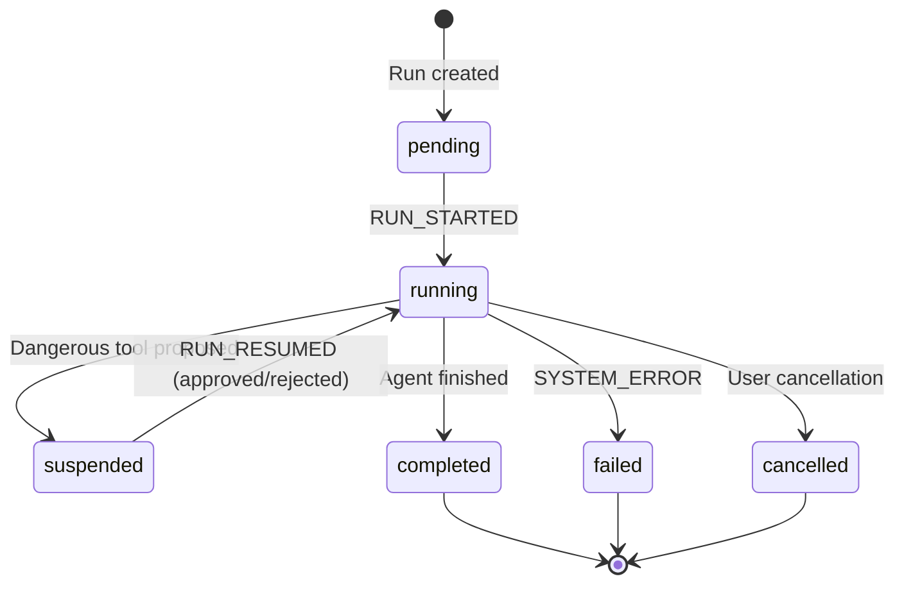
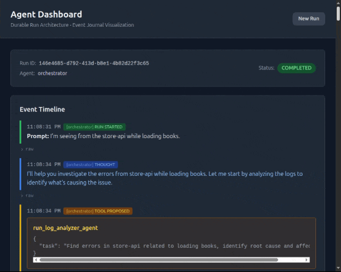

# Building Durable AI Agents: Event Sourcing, State Machines, and Humans in the Middle

*What if AI agents could pause mid-task, wait for human approval, and resume exactly where they left off—even after a server crash?*

---

Building on my [previous ops agent project](https://tonyfoster.dev/building-an-ai-ops-agent), I wanted to solve a fundamental problem: **how do you give AI agents real power without giving them too much rope?**

The answer required combining three patterns: **event sourcing** for durability, a **state machine** for control flow, and **human-in-the-loop** for safety. The result is a durable execution loop that's more complex than I expected—but the complexity is essential.

## The Problem: Autonomous Agents Are Dangerous

When I first built my ops agent framework, agents could execute shell commands, modify files, and restart services. This is powerful—an agent could genuinely debug and fix a production issue. But it's also terrifying.

What happens when the agent decides to run `rm -rf` on the wrong directory? Or makes a "fix" that breaks everything worse? The agent has no concept of "wait, let me think about this more carefully."

The traditional solutions felt inadequate:
- **Sandboxing**: Limits what agents can do, defeating the purpose
- **Confirmation dialogs**: Interrupt the flow, lose context
- **"Safe mode"**: Agents become useless

I needed agents that could *propose* dangerous actions, *pause* for human review, and *resume* seamlessly after approval—without losing any state.

## Human in the Middle: The Core Philosophy

The key insight is that **humans shouldn't be at the end of the loop—they should be in the middle**.

Traditional automation: `Input → Agent → Output`

Human-in-the-loop: `Input → Agent → [PAUSE] → Human Review → Agent → Output`

The agent does the investigation, analysis, and solution design. The human just validates that the proposed action is correct. This is the sweet spot: agents handle the tedious work, humans provide judgment on high-stakes decisions.

But implementing this requires solving two hard problems:
1. **Durability**: The agent must remember everything when it resumes
2. **Control**: The agent must stop exactly when we want it to

Event sourcing and state machines solve these problems.

## Event Sourcing: The Foundation

Here's the key insight: if you record every action as an immutable event in a journal, you get durability for free.

```
┌─────────────────────────────────────────────────┐
│                Event Journal                     │
│  ┌──────────────────────────────────────────┐   │
│  │ 1. RUN_STARTED { prompt: "Fix the bug" } │   │
│  │ 2. AGENT_THOUGHT { text: "I'll check..." }│  │
│  │ 3. TOOL_PROPOSED { shell: "npm test" }   │   │
│  │ 4. RUN_SUSPENDED { reason: "Dangerous" }  │   │
│  │    ─── waiting for human ───              │   │
│  │ 5. RUN_RESUMED { decision: "approved" }   │   │
│  │ 6. TOOL_RESULT { output: "All pass" }     │   │
│  │ 7. RUN_COMPLETED { summary: "Fixed!" }    │   │
│  └──────────────────────────────────────────┘   │
└─────────────────────────────────────────────────┘
```

The journal becomes the single source of truth:
- **Current state?** Replay the events
- **Resume after crash?** Replay the events
- **Audit what happened?** Read the events

If you've worked with event sourcing in distributed systems, this should feel familiar:

| Traditional Event Sourcing | Agent Event Sourcing |
|---------------------------|---------------------|
| Events are facts | Every agent action is an event |
| State is derived | Run state computed from events |
| Append-only log | Journal is immutable |
| Event replay | Resume suspended runs |
| Projections | Message reconstruction for LLM |

The `projectToPrompt()` function is essentially an event projection—it transforms the raw event stream into the format the LLM expects.

## The State Machine: Controlling Agent Lifecycle

Every agent run follows a state machine:



Six states, clear transitions, fully deterministic. The magic happens in the `suspended` state—that's where human oversight lives.

The state machine ensures we always know exactly where an agent is in its lifecycle. Combined with event sourcing, we can:
- Resume a suspended run after server restart
- Cancel a running agent gracefully
- Audit the complete history of state transitions

## The DurableLoop: Where Complexity Lives

Here's where it gets interesting. The core execution engine—the DurableLoop—has one crucial constraint:

```typescript
const result = await generateText({
  model: anthropic('claude-sonnet-4-20250514'),
  maxSteps: 1,  // Execute exactly ONE step
  system: getSystemPrompt(),
  messages,
  tools: preparedTools,
});
```

**`maxSteps: 1`**. This is the key to durability.

After every single LLM interaction, we persist state to the journal. If the server crashes, we lose nothing—just replay the journal and pick up where we left off.

But this constraint creates complexity. The DurableLoop must handle:

### 1. Tool Stripping for HITL

We can't let the LLM auto-execute dangerous tools. So we strip the `execute` function:

```typescript
for (const [name, tool] of Object.entries(allTools)) {
  // Save execute function for later
  if (typeof tool.execute === 'function') {
    executeFunctions.set(name, tool.execute);
  }
  // Strip execute from ALL tools
  const { execute, ...rest } = tool;
  preparedTools[name] = rest;
}
```

The LLM sees the tool, proposes using it, but can't execute it. We execute manually after recording the proposal.

### 2. Event Ordering

Events must be recorded in the correct order. For safe tools:
1. Record `TOOL_PROPOSED`
2. Execute the tool
3. Record `TOOL_RESULT`

If we execute before recording the proposal, child agent events appear before the parent's proposal in the timeline—confusing for users and breaking the audit trail.

### 3. Parent-Child Run Coordination

When an orchestrator delegates to a sub-agent, both runs share the same HITL flow. If the child needs approval:
1. Child run suspends
2. Parent run also suspends (blocked by child)
3. User approves on parent
4. Approval forwards to child
5. Child executes, completes
6. Parent resumes

```typescript
// Check if suspended due to child needing HITL (find LAST suspended event)
const lastSuspended = [...events].reverse().find(e => e.event_type === 'RUN_SUSPENDED');
if (lastSuspended?.payload.blocked_by_child_run_id) {
  // Forward resume to child run
  await resumeRun(lastSuspended.payload.blocked_by_child_run_id, decision);
  return;
}
```

### 4. Message Reconstruction

After resume, we rebuild the LLM conversation from events:

```typescript
function projectToPrompt(events, originalPrompt): CoreMessage[] {
  const messages = [{ role: 'user', content: originalPrompt }];

  for (const event of events) {
    switch (event.event_type) {
      case 'AGENT_THOUGHT':
        // Becomes assistant message with text
        break;
      case 'TOOL_PROPOSED':
        // Becomes tool_call in assistant message
        break;
      case 'TOOL_RESULT':
        // Becomes tool result message
        break;
      case 'RUN_RESUMED':
        // Rejection feedback becomes user message
        if (payload.decision === 'rejected') {
          messages.push({ role: 'user', content: `Rejected: ${payload.feedback}` });
        }
        break;
    }
  }
  return messages;
}
```

This is where event sourcing shines—the projection gives us exactly the conversation state we need.

## Real-Time Event Streaming

How does the Dashboard know when to show the approval UI? Server-Sent Events (SSE) with push-based architecture.

```typescript
// Server pushes events as they're written
journalService.subscribe(runId, (event) => {
  stream.writeSSE({ data: JSON.stringify(event), event: 'event' });

  // Recursively subscribe to child runs
  if (event.type === 'CHILD_RUN_STARTED') {
    subscribeToRun(event.payload.child_run_id);
  }
});
```

No polling. Events stream immediately when written to the journal. Parent and child run events flow through a single SSE connection.

## The Approval UI

When a run suspends, the Dashboard shows an inline approval component:



The interface is intentionally simple:
- Orange highlight screams "PAY ATTENTION"
- Full tool arguments displayed (no hidden surprises)
- Optional feedback field for rejections
- Two buttons: Approve or Reject

When rejected, the feedback gets injected as a user message. The agent sees: "Tool execution was rejected: Please don't run build commands, just read the tests." It can then reconsider its approach.

## A Real Example

Here's a real debugging session:

**1. User submits**: "The store-api is returning 500 errors. Fix it."

**2. Orchestrator delegates** to log analyzer agent

**3. Log analyzer** queries Loki, finds error in `bookService.ts:12`

**4. Orchestrator delegates** to coding agent with specific file

**5. Coding agent** reads file, proposes fix via `write_file`

**6. Run suspends** for human approval

**7. Human reviews** the diff, clicks "Approve"

**8. File written**, coding agent proposes `restart_service`

**9. Run suspends** again for restart approval

**10. Human approves**, service restarts

**11. Run completes** with summary

Total events: ~15. Human interventions: 2. The agents did investigation, analysis, and solution design. The human just validated the dangerous actions.

## Why This Is Complicated

I won't pretend this architecture is simple. The DurableLoop handles:

- **Single-step execution** with journal persistence
- **Tool stripping** to prevent auto-execution
- **Manual tool execution** with proper event ordering
- **State machine transitions** across 6 states
- **Parent-child coordination** for nested agent runs
- **Message projection** for LLM context reconstruction
- **Resume forwarding** when parent is blocked by child
- **Error handling** at every step

Each of these interacts with the others. Get the event ordering wrong, and the timeline is confusing. Get the resume forwarding wrong, and child approvals break. Get the projection wrong, and the LLM loses context.

## Lessons Learned: Use a Framework

Building this from scratch was educational. I now deeply understand:
- How event sourcing applies to AI agents
- Why state machines matter for agent lifecycle
- The subtleties of human-in-the-loop coordination
- How LLM tool calling actually works under the hood

But if I were building this for production, **I would use an agent framework**.

Frameworks like [LangGraph](https://langchain-ai.github.io/langgraph/), [CrewAI](https://www.crewai.com/), or [Temporal](https://temporal.io/) with AI extensions handle much of this complexity:
- Durable execution with checkpointing
- State machine definitions
- Human-in-the-loop primitives
- Tool management

The patterns I implemented manually—event sourcing, state machines, tool stripping—are built into these frameworks. They've solved the edge cases I discovered the hard way.

This project was a great learning experience. It showed me *why* these frameworks exist and *what problems* they solve. But for production AI agents, don't reinvent the wheel.

## What's Next

This architecture enables some interesting future work:

- **Approval Policies**: Auto-approve `npm test` but require approval for `npm publish`
- **Time Travel Debugging**: Replay events to any point in the run
- **Collaborative Approval**: Multiple humans must approve high-risk operations

The foundation is solid. Event sourcing gives us durability and auditability. The state machine gives us control. Human-in-the-loop gives us safety. Together, they let us build AI agents that are genuinely useful for operations work without being genuinely dangerous.

---

The full source code is available at [github.com/tonyfosterdev/agentops](https://github.com/tonyfosterdev/agentops). The key files are:

- `ops/packages/agent-server/src/services/DurableLoop.ts` - Core execution loop
- `ops/packages/agent-server/src/services/JournalService.ts` - Event sourcing
- `ops/packages/agent-server/src/types/journal.ts` - Event type definitions
- `ops/packages/dashboard/src/components/Timeline.tsx` - Approval UI

Questions? Find me on Twitter [@tonyfosterdev](https://twitter.com/tonyfosterdev).
