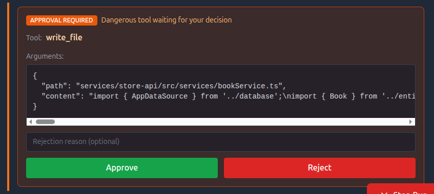
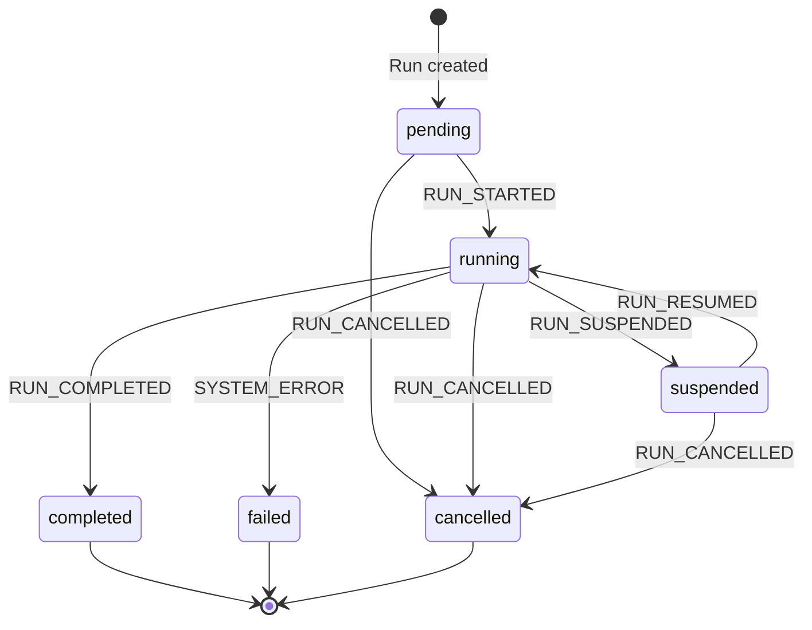

# Building Durable AI Agents: Event Sourcing, State Machines, and Humans in the Middle

*What if AI agents could pause mid-task, wait for human approval, and resume exactly where they left off, even after a server crash?*

Building on my [previous ops agent project](https://tonyfoster.dev/building-an-ai-ops-agent), I wanted to solve two fundamental problems.

**Problem A: Unsupervised Agents Are Dangerous**

My ops agent framework gives agents real power. They can execute shell commands and modify files. This is useful; an agent can genuinely debug and fix issues. But some of these calls are dangerous. An agent might run `rm -rf` on the wrong directory, or make a "fix" that breaks things worse.

The agent is acting unsupervised. It has no concept of "wait, let me think about this more carefully."

The obvious solution is confirmation dialogs: ask the human before doing anything dangerous. But traditional confirmation dialogs have a problem. If you wait hours for approval, or the server restarts, you lose all context. The agent forgets what it was doing.

I needed agents that could propose dangerous actions, pause for human review, and resume after approval without losing state.

**Problem B: Agent Execution State Is Ephemeral**

In my previous agent, execution state lived in memory. The agent would query logs, read files, and propose a fix. But if the server restarted while waiting for approval, that pending tool call was gone. It was just a variable in the running process.

For operational tasks, I needed that execution state persisted.

**Problem C: No Audit Trail**

When agents execute tools autonomously, you need to know what happened. My previous agent had no record of what it did or why. If something went wrong, I couldn't trace the agent's reasoning or actions.

The answer required combining three patterns: **event sourcing** for durability and auditability, a **state machine** for control flow, and **human-in-the-loop** for safety.

## An Example

Before diving into implementation, here's what human-in-the-loop looks like in practice.

**1. User submits**: "The store-api is returning 500 errors. Fix it."

**2. Orchestrator delegates** to log analyzer agent

**3. Log analyzer** queries Loki, finds error in `bookService.ts:12`

**4. Orchestrator delegates** to coding agent with specific file

**5. Coding agent** reads file, proposes fix via `write_file`

**6. Run suspends** for human approval

**7. Human reviews** the diff, clicks "Approve"

**8. File written**, run completes with summary



The agents handled investigation, analysis, and solution design. The human just validated the file write.

This is the core idea: instead of fully automated execution, the agent pauses before dangerous operations and waits for human judgment. The agent does the tedious work; humans make the high-stakes decisions.

## Durability

My previous agent kept everything in memory. It couldn't safely suspend or recover from service interruptions:

- Voluntary interruptions (waiting for approval) or involuntary ones (server restarts) cause the agent to lose its place
- Complex work across multiple agents can't be coordinated

I needed execution state persisted so the agent could pause, wait, and resume.

## Event Sourcing

Event sourcing solves all three problems at once. Instead of storing current state, you store every action as an immutable event in a journal:

- **HITL**: Record the proposed tool call as an event. The agent can suspend, wait for approval, and resume by replaying the journal.
- **Durability**: Server restarts? Replay the events to reconstruct exactly where the agent left off.
- **Auditability**: The journal is a complete history of everything the agent did.

### Event Types

A run is modeled as a sequence of events. Each significant action gets its own event type:

| Event Type | Description |
|------------|-------------|
| `RUN_STARTED` | Agent begins processing |
| `AGENT_THOUGHT` | LLM reasoning text |
| `TOOL_PROPOSED` | Agent proposes an action |
| `RUN_SUSPENDED` | Waiting for human |
| `RUN_RESUMED` | Human decision recorded |
| `TOOL_RESULT` | Action outcome |
| `CHILD_RUN_STARTED` | Orchestrator delegates |
| `CHILD_RUN_COMPLETED` | Sub-agent finished |
| `RUN_COMPLETED` / `RUN_CANCELLED` / `SYSTEM_ERROR` | Terminal states |

### State Machine

Every agent run follows a state machine:



Six states, clear transitions. The `suspended` state is where human oversight lives. The agent waits here until the user approves or rejects the proposed action.

Events drive state transitions. When we record `RUN_SUSPENDED`, the run moves to `suspended`. When we record `RUN_RESUMED`, it moves back to `running`. The state machine defines valid transitions, but events are the source of truth.

### The Event Journal

Events are stored in an append-only journal. Here's what a typical run looks like:

| Seq | Event Type | Payload |
|-----|------------|---------|
| 1 | `RUN_STARTED` | `{ prompt: "Fix the bug" }` |
| 2 | `AGENT_THOUGHT` | `{ text: "I'll check the logs..." }` |
| 3 | `TOOL_PROPOSED` | `{ tool: "write_file", args: {...} }` |
| 4 | `RUN_SUSPENDED` | `{ reason: "Dangerous tool" }` |
| | *— waiting for human —* | |
| 5 | `RUN_RESUMED` | `{ decision: "approved" }` |
| 6 | `TOOL_RESULT` | `{ output: "File written" }` |
| 7 | `RUN_COMPLETED` | `{ summary: "Fixed the bug" }` |

The journal is the single source of truth. To reconstruct current state or resume after a crash, replay the events.

## The DurableLoop

The DurableLoop is the core execution engine. It runs the agent one step at a time, persisting state after each step.

### Single-Step Execution

I use the [Vercel AI SDK](https://sdk.vercel.ai/) to interact with Claude. The SDK has a `maxSteps` parameter that controls how many LLM interactions happen before returning:

```typescript
const result = await generateText({
  model: anthropic('claude-sonnet-4-20250514'),
  maxSteps: 1,  // Execute exactly ONE step
  system: systemPrompt,
  messages,
  tools: preparedTools,
});
```

Setting `maxSteps: 1` means we get control back after every LLM response. After each step, we persist the agent's thoughts and tool calls to the journal. If the server crashes, we replay the journal and continue from where we left off.

### Tool Stripping

The Vercel AI SDK automatically executes tool functions when the LLM proposes them. This is convenient, but it's a problem for HITL. I need to intercept dangerous tool calls before they execute.

The solution: strip the `execute` function from every tool before passing them to the SDK.

```typescript
const executeFunctions = new Map<string, Function>();

for (const [name, tool] of Object.entries(allTools)) {
  // Save execute function for later
  if (typeof tool.execute === 'function') {
    executeFunctions.set(name, tool.execute);
  }
  // Strip execute - SDK can't auto-run it now
  const { execute, ...rest } = tool;
  preparedTools[name] = rest;
}
```

Now the LLM can propose tools, but can't execute them. I execute manually after checking if the tool is dangerous:

```typescript
// Record TOOL_PROPOSED first
await journalService.appendEvent(runId, {
  type: 'TOOL_PROPOSED',
  payload: { tool_name, args, call_id },
});

if (isDangerousTool(tool_name)) {
  // Suspend and wait for human approval
  await journalService.appendEvent(runId, {
    type: 'RUN_SUSPENDED',
    payload: { reason: `Dangerous tool: ${tool_name}` },
  });
  return { needsApproval: true };
}

// Safe tool - execute immediately
const result = await executeFunctions.get(tool_name)(args);
await journalService.appendEvent(runId, {
  type: 'TOOL_RESULT',
  payload: { call_id, output_data: result },
});
```

### Message Reconstruction

When the agent resumes, either after approval or after a server restart, we need to rebuild the conversation for the LLM. The `projectToPrompt()` function replays journal events into the message format the SDK expects:

- `AGENT_THOUGHT` → assistant message
- `TOOL_PROPOSED` → tool call in assistant message
- `TOOL_RESULT` → tool result message
- `RUN_RESUMED` (rejected) → user message with feedback

This is the core of event sourcing: state is derived by replaying events.

### Parent-Child Coordination

The orchestrator agent delegates tasks to specialized sub-agents (coding agent, log analyzer). When a child agent proposes a dangerous tool, both runs need to coordinate:

1. Child proposes dangerous tool → child run suspends
2. Parent run also suspends, recording `blocked_by_child_run_id`
3. User approves → approval forwards to the child
4. Child executes and completes → parent resumes

The user only sees one approval dialog. The parent-child coordination happens behind the scenes.

## The Dashboard

The event journal can power real-time user interfaces. The dashboard in this project is an illustration of that. When the user submits a task, they see events stream in as the agent works.

### Event Streaming

The `JournalService` uses an internal `EventEmitter`. When an event is appended, it's both persisted to PostgreSQL and emitted to subscribers:

```typescript
class JournalService {
  private emitter = new EventEmitter();

  async appendEvent(runId, event) {
    await this.entryRepository.save(event);
    this.emitter.emit(`run:${runId}`, event);
  }

  subscribe(runId, callback) {
    this.emitter.on(`run:${runId}`, callback);
    return () => this.emitter.off(`run:${runId}`, callback);
  }
}
```

The dashboard connects via Server-Sent Events (SSE). Events stream immediately, no polling.

### The Approval UI

When a `RUN_SUSPENDED` event arrives, the dashboard shows an approval dialog:


The user sees the tool name and arguments, and can approve or reject. On rejection, they can provide feedback that gets injected as a user message. The agent sees "Tool execution was rejected: [feedback]" and can reconsider its approach.

## Limitations & Caveats

### Tool Idempotency

This architecture doesn't guarantee complete durability in all cases. If a crash occurs mid-tool-execution:
1. The tool executes
2. Server crashes
3. On restart, we replay events
4. Tool may re-execute

Tools must be written with care for idempotent replay:
- `write_file` is safe to replay (same content, same result)
- A hypothetical `send_email` tool would NOT be safe. Replaying it would spam duplicate emails.

This is true of all event-sourced systems. The solution is idempotency keys at the tool level, which I didn't implement here.

### The Dual Write Problem

Journal events aren't 100% accurate under disruption. If the server crashes after tool execution but before the event is recorded, the journal is incomplete.

For this application (dashboard visualization and HITL) that's fine. But this architecture is NOT suitable for replicating events to a permanent store where accuracy is critical.

If you need true durability, use the [Outbox Pattern](https://medium.com/@mohantyshyama/designing-fault-tolerant-systems-solving-dual-writes-with-cdc-and-outbox-dd9a4ee727bb) or Change Data Capture (CDC).

## Lessons Learned

The architecture is conceptually simple: store events, derive state, replay to resume. But the implementation isn't trivial. The DurableLoop handles single-step execution, tool stripping, manual execution with proper event ordering, state machine transitions, parent-child coordination, message projection, resume forwarding, and error handling. All of these interact with each other.

Get the event ordering wrong, and the timeline is confusing. Get the resume forwarding wrong, and child approvals break. Get the projection wrong, and the LLM loses context.

It's time to move to proven, hardened frameworks that handle this complexity for me. [AgentKit](https://agentkit.inngest.com/overview), [LangGraph](https://langchain-ai.github.io/langgraph/), [CrewAI](https://www.crewai.com/), and [Temporal](https://temporal.io/) have already solved these edge cases.

## What's Next

I'm converting this project to [Inngest](https://www.inngest.com/) for durable execution and setting up [OpenTelemetry](https://opentelemetry.io/) for first-class observability. Then I'll explore making the agent more autonomous while keeping human-in-the-loop for the decisions that matter. Stay tuned.

The full source code is available at [github.com/tonyfosterdev/agentops](https://github.com/tonyfosterdev/agentops). The key files are:

- `ops/packages/agent-server/src/services/DurableLoop.ts` - Core execution loop
- `ops/packages/agent-server/src/services/JournalService.ts` - Event sourcing
- `ops/packages/agent-server/src/types/journal.ts` - Event type definitions
- `ops/packages/dashboard/src/components/Timeline.tsx` - Approval UI
