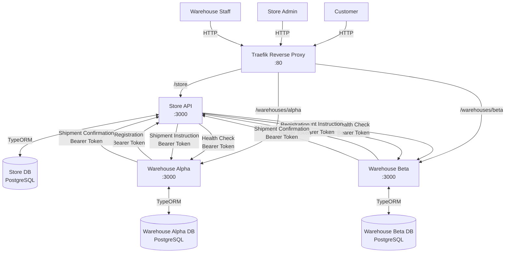
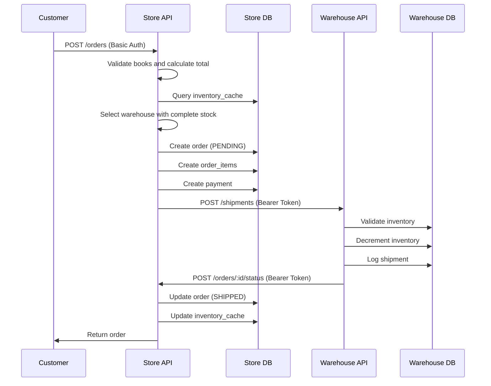
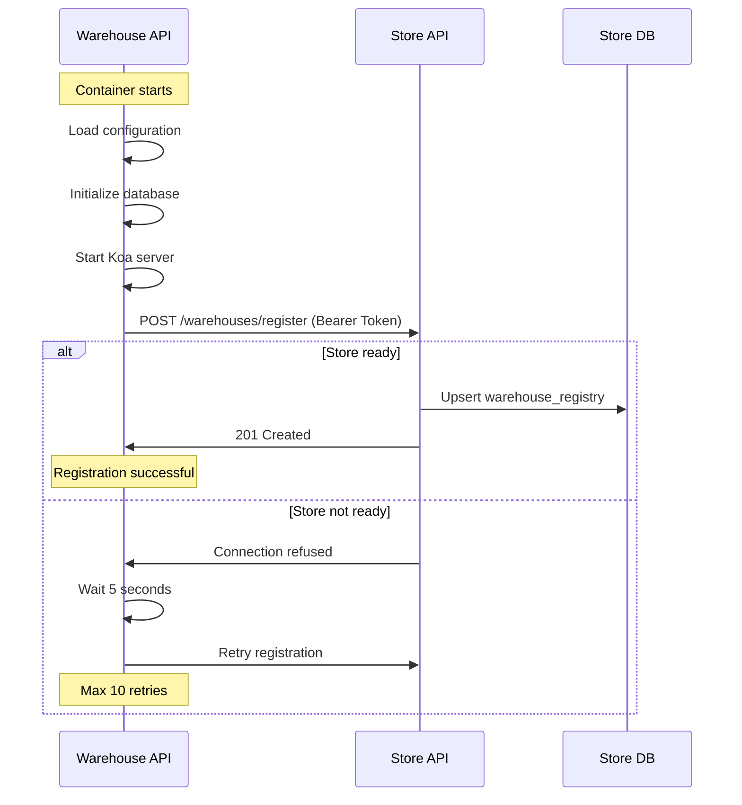
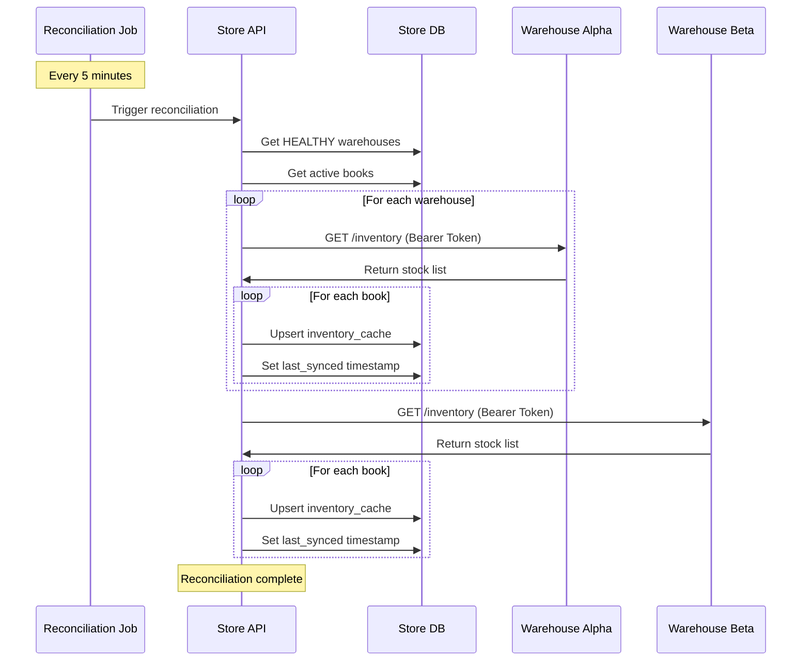
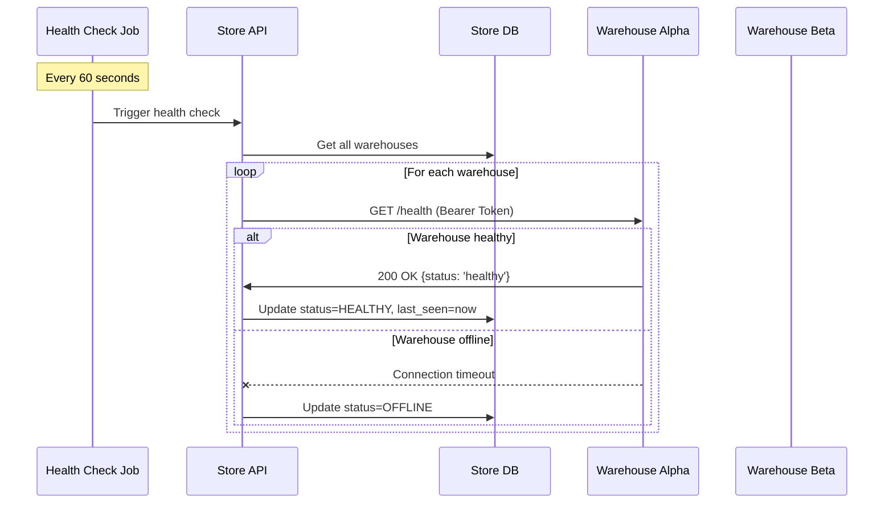

# Agentic Store Ops - Architecture Documentation

## System Overview

Agentic Store Ops is a distributed bookstore system demonstrating microservices architecture, service discovery, inventory reconciliation, and order fulfillment patterns.

## Architecture Diagram



## Service Architecture

### Store API (Port 3000)

**Purpose**: Central command center for the bookstore

**Responsibilities**:
- User authentication and authorization (Customers, Admins)
- Book catalog management
- Order processing and fulfillment coordination
- Warehouse service registry
- Inventory cache management
- Background jobs (health checks, inventory reconciliation)

**Tech Stack**:
- Koa.js (Web framework)
- TypeORM (Database ORM)
- PostgreSQL (Database)
- bcrypt (Password hashing)
- node-cron (Background jobs)
- axios (HTTP client)

**Database Schema** (7 tables):
- `users` - Customer and admin accounts
- `books` - Book catalog
- `inventory_cache` - Cached warehouse inventory
- `orders` - Customer orders
- `order_items` - Line items in orders
- `payments` - Payment records
- `warehouse_registry` - Registered warehouse services

### Warehouse API (Port 3000)

**Purpose**: Physical inventory management and order fulfillment

**Responsibilities**:
- Warehouse staff authentication
- Local inventory management
- Shipment processing
- Automatic registration with Store on startup
- Health check reporting

**Tech Stack**:
- Koa.js (Web framework)
- TypeORM (Database ORM)
- PostgreSQL (Database)
- bcrypt (Password hashing)
- axios (HTTP client)

**Database Schema** (3 tables):
- `users` - Warehouse staff accounts
- `inventory` - Physical book inventory
- `shipment_logs` - Shipment history

## Data Flow Diagrams

### Order Placement Flow



### Warehouse Registration Flow



### Inventory Reconciliation Flow



### Health Check Flow



## Network & Routing

### Traefik Configuration

**Routing Rules**:
- `Host(api.localhost) && PathPrefix(/store)` → Store API (strip `/store`)
- `Host(api.localhost) && PathPrefix(/warehouses/alpha)` → Warehouse Alpha (strip `/warehouses/alpha`)
- `Host(api.localhost) && PathPrefix(/warehouses/beta)` → Warehouse Beta (strip `/warehouses/beta`)

**Service Discovery**: Docker provider with labels

**Ports**:
- 80: HTTP entrypoint
- 8080: Traefik dashboard

### Port Mappings

| Service | Internal Port | External Port | Access |
|---------|--------------|---------------|--------|
| Traefik | 80 | 80 | Public |
| Traefik Dashboard | 8080 | 8080 | Public |
| Store API | 3000 | - | Via Traefik |
| Warehouse Alpha | 3000 | - | Via Traefik |
| Warehouse Beta | 3000 | - | Via Traefik |
| Store DB | 5432 | 5432 | Internal + Host |
| Warehouse Alpha DB | 5432 | 5433 | Internal + Host |
| Warehouse Beta DB | 5432 | 5434 | Internal + Host |

## Authentication & Authorization

### HTTP Basic Authentication

**Used for**: User-to-API communication

**Endpoints**:
- Store: Customer and Admin operations
- Warehouse: Staff operations

**Format**: `Authorization: Basic base64(email:password)`

**Roles**:
- `CUSTOMER` - Browse books, place orders, view own orders
- `STORE_ADMIN` - All customer operations + manage catalog, view all orders, manage warehouses
- `WAREHOUSE_STAFF` - View/manage local inventory, view shipment logs

### Bearer Token Authentication

**Used for**: Service-to-service communication

**Endpoints**:
- Store ↔ Warehouse: Registration, health checks, shipments, inventory queries

**Format**: `Authorization: Bearer {SERVICE_SECRET}`

**Configuration**: Shared secret in environment variables

## Background Jobs

### Health Check Job

**Frequency**: Every 60 seconds (configurable)

**Purpose**: Monitor warehouse availability

**Process**:
1. Query all registered warehouses
2. Send `GET /health` with Bearer token to each
3. Update `warehouse_registry.status` and `last_seen`
4. Mark as `OFFLINE` on timeout or error

### Inventory Reconciliation Job

**Frequency**: Every 300 seconds (5 minutes, configurable)

**Purpose**: Sync Store's inventory cache with warehouse reality

**Process**:
1. Query all `HEALTHY` warehouses
2. Request full inventory via `GET /inventory`
3. Update `inventory_cache` for each book/warehouse pair
4. Set `last_synced` timestamp

## Database Isolation

Each service has its own PostgreSQL instance:

- **Store DB**: `store_db` on `store-db:5432`
- **Warehouse Alpha DB**: `warehouse_alpha_db` on `warehouse-alpha-db:5432`
- **Warehouse Beta DB**: `warehouse_beta_db` on `warehouse-beta-db:5432`

**No direct database connections between services** - all communication via HTTP APIs.

## Scalability Considerations

### Current Limitations

1. **Single warehouse fulfillment only** - Orders must be fulfilled by one warehouse
2. **Synchronous order processing** - Blocking call to warehouse during order placement
3. **Polling-based inventory sync** - Every 5 minutes, not event-driven
4. **No distributed transactions** - Eventual consistency model

### Future Improvements

1. **Multi-warehouse fulfillment** - Split orders across warehouses
2. **Event-driven architecture** - Use message queue (RabbitMQ, Kafka)
3. **Real-time inventory updates** - WebSockets or Server-Sent Events
4. **Distributed tracing** - OpenTelemetry for observability
5. **Circuit breakers** - Resilience4j or similar for fault tolerance
6. **API Gateway** - Rate limiting, caching, request aggregation

## Security Considerations

### Current Implementation (Demo/Development Only)

This application implements basic security suitable for local development and testing:

- ✅ HTTP Basic Auth for users
- ✅ Shared secret for services
- ✅ Password hashing with bcrypt
- ✅ SQL injection protection (TypeORM parameterized queries)
- ✅ CORS enabled

**Note**: This is a proof-of-concept application. It is **not secure for production use** and lacks essential security features such as HTTPS/TLS, proper secret management, rate limiting, comprehensive input validation, and security testing.

## Deployment

### Local Development

```bash
docker compose up --build
```

### Environment Variables

See `.env.example` files in each service directory.

### Database Migrations

```bash
# Generate migration
docker compose exec store-api npm run migration:generate -- -n MigrationName

# Run migrations
docker compose exec store-api npm run migration:run

# Revert migration
docker compose exec store-api npm run migration:revert
```

## Monitoring & Debugging

### Logs

```bash
# All services
docker compose logs -f

# Specific service
docker compose logs -f store-api
docker compose logs -f warehouse-alpha
```

### Database Access

```bash
# Store DB
docker compose exec store-db psql -U storeuser -d store_db

# Warehouse Alpha DB
docker compose exec warehouse-alpha-db psql -U warehouseuser -d warehouse_alpha_db
```

### Traefik Dashboard

Access at: http://localhost:8080

## Performance Characteristics

### Expected Load

- **Orders**: 10-100 per minute
- **Book catalog**: 1000-10000 books
- **Warehouses**: 2-10 locations
- **Concurrent users**: 100-1000

### Bottlenecks

1. **Order placement** - Synchronous warehouse call adds latency
2. **Inventory queries** - Cache reduces DB load but may be stale
3. **Health checks** - Sequential polling of all warehouses

## Technologies Used

| Component | Technology | Version |
|-----------|-----------|---------|
| Runtime | Node.js | 20+ |
| Language | TypeScript | 5.3+ |
| Web Framework | Koa.js | 2.15+ |
| ORM | TypeORM | 0.3.20+ |
| Database | PostgreSQL | 16+ |
| Reverse Proxy | Traefik | 2.11+ |
| Containerization | Docker Compose | 3.8+ |

## Glossary

- **Service Registry**: Database of registered warehouse services
- **Inventory Cache**: Store's local copy of warehouse inventory for fast queries
- **Reconciliation**: Process of syncing cached inventory with source of truth
- **Bearer Token**: Service authentication credential
- **Single Warehouse Fulfillment**: Constraint that entire order ships from one location
