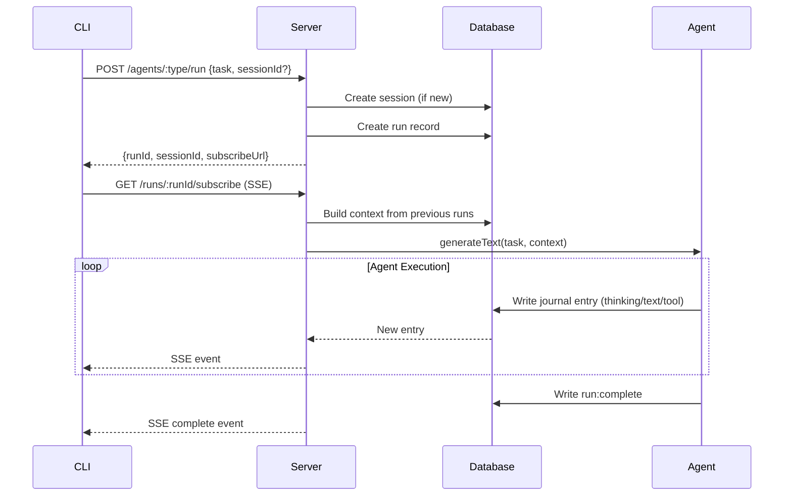
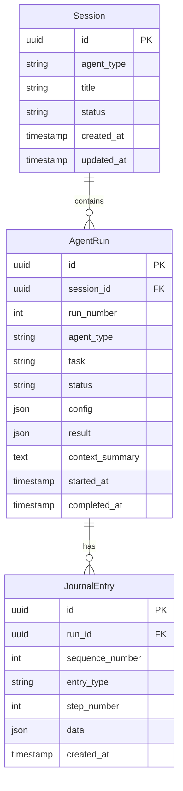
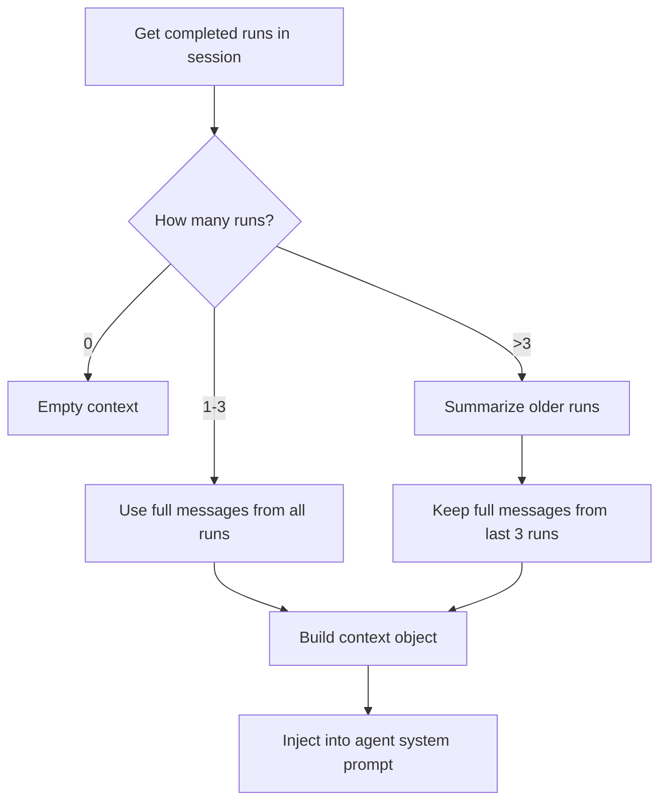

# Agent Journaling System

This document describes the journaling system implementation that replaces the direct streaming approach with a database-backed journal for better feedback and conversational sessions.

## Overview

The system was migrated from `streamText` to `generateText` pattern with a PostgreSQL-backed journal. The CLI subscribes to journal updates via SSE for real-time feedback, and sessions enable multi-turn conversations with context.

## Architecture



## Database Schema

### Tables

```sql
-- Sessions group multiple runs for conversation context
CREATE TABLE sessions (
  id UUID PRIMARY KEY DEFAULT uuid_generate_v4(),
  agent_type VARCHAR(50) NOT NULL,
  title VARCHAR(255),
  status VARCHAR(20) NOT NULL DEFAULT 'active',  -- 'active' | 'archived'
  created_at TIMESTAMP DEFAULT NOW(),
  updated_at TIMESTAMP DEFAULT NOW()
);

-- Individual agent runs within a session
CREATE TABLE agent_runs (
  id UUID PRIMARY KEY DEFAULT uuid_generate_v4(),
  session_id UUID NOT NULL REFERENCES sessions(id) ON DELETE CASCADE,
  run_number INTEGER NOT NULL,
  agent_type VARCHAR(50) NOT NULL,
  task TEXT NOT NULL,
  status VARCHAR(20) NOT NULL DEFAULT 'running',  -- 'running' | 'completed' | 'failed'
  config JSONB,
  result JSONB,
  context_summary TEXT,
  started_at TIMESTAMP DEFAULT NOW(),
  completed_at TIMESTAMP,
  created_at TIMESTAMP DEFAULT NOW()
);

-- Journal entries for each run
CREATE TABLE journal_entries (
  id UUID PRIMARY KEY DEFAULT uuid_generate_v4(),
  run_id UUID NOT NULL REFERENCES agent_runs(id) ON DELETE CASCADE,
  sequence_number INTEGER NOT NULL,
  entry_type VARCHAR(50) NOT NULL,
  step_number INTEGER,
  data JSONB NOT NULL,
  created_at TIMESTAMP DEFAULT NOW()
);
```

### Entity Relationships



## API Endpoints

### Sessions

#### POST /sessions
Create a new session.

**Request:**
```json
{
  "agentType": "coding" | "log-analyzer" | "orchestration",
  "title": "Optional session title"
}
```

**Response:**
```json
{
  "sessionId": "uuid",
  "runUrl": "/sessions/{sessionId}/runs"
}
```

#### GET /sessions
List all sessions.

**Query Parameters:**
- `status` - Filter by status ('active' | 'archived')
- `agentType` - Filter by agent type
- `limit` - Max results (default 50)
- `offset` - Pagination offset

**Response:**
```json
[
  {
    "id": "uuid",
    "agentType": "orchestration",
    "title": "Debug session",
    "status": "active",
    "createdAt": "2024-01-01T00:00:00Z",
    "updatedAt": "2024-01-01T00:00:00Z"
  }
]
```

#### GET /sessions/:sessionId
Get session details with runs.

**Response:**
```json
{
  "session": {
    "id": "uuid",
    "agentType": "orchestration",
    "status": "active",
    ...
  },
  "runs": [
    {
      "id": "uuid",
      "runNumber": 1,
      "task": "Find the bug",
      "status": "completed",
      ...
    }
  ]
}
```

#### POST /sessions/:sessionId/runs
Start a new run in an existing session.

**Request:**
```json
{
  "task": "Now fix it",
  "config": {
    "maxSteps": 10,
    "model": "claude-3-opus"
  }
}
```

**Response:**
```json
{
  "runId": "uuid",
  "subscribeUrl": "/runs/{runId}/subscribe"
}
```

### Runs

#### GET /runs/:runId
Get run details with journal entries.

**Response:**
```json
{
  "run": {
    "id": "uuid",
    "sessionId": "uuid",
    "runNumber": 1,
    "task": "Find the bug",
    "status": "completed",
    "result": { "success": true, "message": "..." },
    ...
  },
  "entries": [
    {
      "id": "uuid",
      "entryType": "text",
      "stepNumber": 1,
      "data": { "text": "Analyzing the code..." },
      "createdAt": "..."
    }
  ]
}
```

#### GET /runs/:runId/subscribe
Subscribe to run updates via Server-Sent Events.

**Event Types:**

```typescript
// Journal entry event
{
  "type": "entry",
  "entry": {
    "id": "uuid",
    "entry_type": "run:started" | "thinking" | "text" | "tool:starting" | "tool:complete" | "step:complete" | "run:complete" | "run:error",
    "step_number": 1,
    "data": { ... },
    "created_at": "..."
  }
}

// Stream complete event
{
  "type": "complete",
  "run": {
    "id": "uuid",
    "status": "completed",
    "result": { ... }
  }
}
```

### Agents (Modified)

#### POST /agents/:type/run
Start agent execution (auto-creates session if none provided).

**Request:**
```json
{
  "task": "Fix the authentication bug",
  "sessionId": "uuid (optional - continues existing session)",
  "config": {
    "maxSteps": 10,
    "model": "claude-3-opus"
  }
}
```

**Response:**
```json
{
  "runId": "uuid",
  "sessionId": "uuid",
  "subscribeUrl": "/runs/{runId}/subscribe"
}
```

## Journal Entry Types

| Type | Description | Data Fields |
|------|-------------|-------------|
| `run:started` | Run has started | `task`, `maxSteps`, `agentType` |
| `thinking` | AI is processing (heartbeat) | `elapsed_ms` |
| `text` | Text output from agent | `text`, `stepNumber` |
| `tool:starting` | Tool execution starting | `toolName`, `toolCallId`, `args`, `stepNumber` |
| `tool:complete` | Tool execution finished | `toolName`, `toolCallId`, `result`, `success`, `summary`, `stepNumber` |
| `step:complete` | Agent step completed | `stepNumber` |
| `run:complete` | Run finished successfully | `success`, `message`, `steps` |
| `run:error` | Run failed | `error`, `stepNumber` |

## Context Building

The system builds conversation context using a "Summary + Recent" strategy:



**Context Structure:**
```typescript
interface ConversationContext {
  summary: string;              // Summarized older runs
  recentMessages: Message[];    // Full messages from last 3 runs
}
```

**Message Format:**
- User messages: The original task
- Assistant messages: Agent text responses + tool summaries

### Entry Types in Context

The ContextService selectively includes only meaningful conversational content:

| Entry Type | Included | What's Used |
|------------|----------|-------------|
| `run:started` | ❌ | - |
| `thinking` | ❌ | - |
| `text` | ✅ | Full text content |
| `tool:starting` | ❌ | - |
| `tool:complete` | ✅ | Summary field only (formatted as `[Tool: name] summary`) |
| `step:complete` | ❌ | - |
| `run:complete` | ✅ | Message field |
| `run:error` | ❌ | - |

**Why these exclusions:**
- `thinking` - Heartbeat signals during AI processing, not conversational
- `run:started` - Initialization metadata, not meaningful content
- `tool:starting` - Redundant since `tool:complete` has the result
- `step:complete` - Internal step boundary markers
- `run:error` - Failed runs are excluded from context entirely

**Run Filtering:**
- Only `completed` runs are included
- `running` and `failed` runs are excluded from context

## Services

### SessionService
Manages session lifecycle.

```typescript
class SessionService {
  createSession(agentType: string, title?: string): Promise<string>
  getSession(sessionId: string): Promise<Session | null>
  listSessions(filters?: SessionFilters): Promise<Session[]>
  archiveSession(sessionId: string): Promise<void>
}
```

### JournalService
Handles run and journal entry persistence.

```typescript
class JournalService {
  createRun(sessionId: string, agentType: string, task: string, config?: any): Promise<string>
  writeEntry(runId: string, entryType: string, data: any): Promise<void>
  getEntriesSince(runId: string, afterSequence: number): Promise<JournalEntry[]>
  getRun(runId: string): Promise<AgentRun | null>
  completeRun(runId: string, result: any): Promise<void>
  failRun(runId: string, error: string): Promise<void>
  getRunsForSession(sessionId: string): Promise<AgentRun[]>
}
```

### ContextService
Builds conversation context from session history.

```typescript
class ContextService {
  buildContext(sessionId: string): Promise<ConversationContext>
}
```

## OutputSink Abstraction

Agents write output through an `OutputSink` interface, decoupling them from the journal implementation.

### Interface

```typescript
interface OutputSink {
  writeRunStarted(data: { task: string; maxSteps: number; agentType: string }): Promise<void>;
  writeThinking(elapsedMs: number): Promise<void>;
  writeText(text: string, stepNumber: number): Promise<void>;
  writeToolStarting(toolName: string, toolCallId: string, args: Record<string, unknown>, stepNumber: number): Promise<void>;
  writeToolComplete(toolName: string, toolCallId: string, result: unknown, success: boolean, summary: string, stepNumber: number): Promise<void>;
  writeStepComplete(stepNumber: number): Promise<void>;
  writeRunComplete(result: { success: boolean; message: string; steps: number }): Promise<void>;
  writeRunError(error: string): Promise<void>;
}
```

### Implementations

| Implementation | Purpose |
|----------------|---------|
| `JournalOutputSink` | Writes to database via JournalService, manages heartbeat automatically |
| `NoOpOutputSink` | Silent no-op, used for sub-agent delegation where output is captured by parent |

### Agent Signature

All agents implement `run()` with the OutputSink:

```typescript
async run(
  task: string,
  context: ConversationContext,
  sink: OutputSink
): Promise<AgentResult>
```

**Key characteristics:**
1. Uses `generateText` (not `streamText`) for agentic loop control
2. Writes to OutputSink instead of emitting events
3. Accepts conversation context from previous runs
4. Heartbeat managed by sink during AI thinking (every 2s)
5. Uses `onStepFinish` callback for output writes

## CLI Changes

### New Features
- **Session Management**: Auto-continues sessions across runs
- **Commands**: `/new` to reset session, `/session` to show current
- **Thinking Indicator**: Shows elapsed time while AI processes
- **Session ID Flag**: `--session-id` for CLI run command

### AgentClient API

```typescript
class AgentClient {
  // Session management
  createSession(agentType: string, title?: string): Promise<string>
  getSessionId(): string | null
  setSessionId(sessionId: string): void
  resetSession(): void

  // Running agents
  startRun(agentType: string, task: string, options?: RunOptions): Promise<RunInfo>
  subscribeToRun(runId: string): Promise<void>
  runAgent(agentType: string, task: string, options?: RunOptions): Promise<void>

  // Querying
  listSessions(filters?: SessionFilters): Promise<Session[]>
  getSession(sessionId: string): Promise<SessionWithRuns>
}
```

## Files Changed

### New Files
| File | Purpose |
|------|---------|
| `infra/postgres/init-ops.sql` | Database schema |
| `agent-server/src/database.ts` | TypeORM DataSource |
| `agent-server/src/entities/Session.ts` | Session entity |
| `agent-server/src/entities/AgentRun.ts` | Run entity |
| `agent-server/src/entities/JournalEntry.ts` | Entry entity |
| `agent-server/src/services/SessionService.ts` | Session management |
| `agent-server/src/services/JournalService.ts` | Journal operations |
| `agent-server/src/services/ContextService.ts` | Context building |
| `agent-server/src/routes/sessions.ts` | Session API routes |
| `agent-server/src/routes/runs.ts` | Run API routes |
| `agent-server/src/routes/agentExecutor.ts` | Agent execution orchestration |
| `agent-server/src/sinks/OutputSink.ts` | Output abstraction interface |
| `agent-server/src/sinks/JournalOutputSink.ts` | Journal-backed sink with heartbeat |
| `agent-server/src/sinks/NoOpOutputSink.ts` | No-op sink for sub-agent delegation |

### Modified Files
| File | Changes |
|------|---------|
| `docker-compose.yaml` | Added ops-db container |
| `.env.example` | Added OPS_DB_* variables |
| `agent-server/package.json` | Added typeorm, pg dependencies |
| `agent-server/tsconfig.json` | Added decorator support |
| `agent-server/src/config.ts` | Added database config |
| `agent-server/src/index.ts` | Initialize database on startup |
| `agent-server/src/app.ts` | Register new routes |
| `agent-server/src/routes/agents.ts` | Modified to use journal system |
| `agent-server/src/agents/coding/agent.ts` | Uses OutputSink pattern |
| `agent-server/src/agents/log-analyzer/agent.ts` | Uses OutputSink pattern |
| `agent-server/src/agents/orchestration/agent.ts` | Uses OutputSink pattern |
| `ops-shared/src/base/BaseAgent.ts` | Removed event infrastructure |
| `ops-cli/src/api/client.ts` | Session management, journal subscription |
| `ops-cli/src/ui/App.tsx` | Session UI, thinking indicator |
| `ops-cli/src/ui/AgentRunner.tsx` | Journal event handling |
| `ops-cli/src/commands/run.ts` | Journal events, session support |
| `ops-cli/src/index.ts` | Added --session-id flag |

### Deleted Files (OutputSink refactoring)
| File | Reason |
|------|--------|
| `agent-server/src/utils/streamingHelper.ts` | Replaced by OutputSink |
| `agent-server/src/services/AgentRunner.ts` | Replaced by agentExecutor.ts |
| `ops-shared/src/events/AgentEventEmitter.ts` | Events removed in favor of journal |
| `ops-shared/src/events/types.ts` | Events removed in favor of journal |
| `ops-shared/src/events/index.ts` | Events removed in favor of journal |

## Environment Variables

Add to `.env`:

```bash
# Ops Database
OPS_DB_HOST=localhost
OPS_DB_PORT=5435
OPS_DB_USERNAME=opsuser
OPS_DB_PASSWORD=your-secure-password
OPS_DB_DATABASE=ops_db
```

## Docker Setup

The ops-db container is automatically started with docker-compose:

```yaml
ops-db:
  image: postgres:16-alpine
  container_name: ops-db
  environment:
    POSTGRES_USER: ${OPS_DB_USERNAME:-opsuser}
    POSTGRES_PASSWORD: ${OPS_DB_PASSWORD}
    POSTGRES_DB: ${OPS_DB_DATABASE:-ops_db}
  volumes:
    - ops-db-data:/var/lib/postgresql/data
    - ./infra/postgres/init-ops.sql:/docker-entrypoint-initdb.d/init.sql
  ports:
    - "5435:5432"
  healthcheck:
    test: ["CMD-SHELL", "pg_isready -U opsuser -d ops_db"]
```

## Example Conversation Flow

```
# First message - creates new session
User: "Find the bug in store-api orders"
→ Creates Session S1, Run R1
→ Agent investigates, writes to journal
→ CLI shows progress via SSE

# Second message - continues session automatically
User: "Now fix it"
→ Uses existing Session S1, creates Run R2
→ Context includes: summary of R1 + full R1 messages
→ Agent knows what bug was found, can fix it

# Third message - still in session
User: "Run the tests to verify"
→ Uses Session S1, creates Run R3
→ Context includes: summary + R1, R2 messages

# User wants fresh start
User: /new
→ Resets session

# Next message starts fresh
User: "Help with warehouse-api"
→ Creates new Session S2, Run R1
→ No prior context
```
