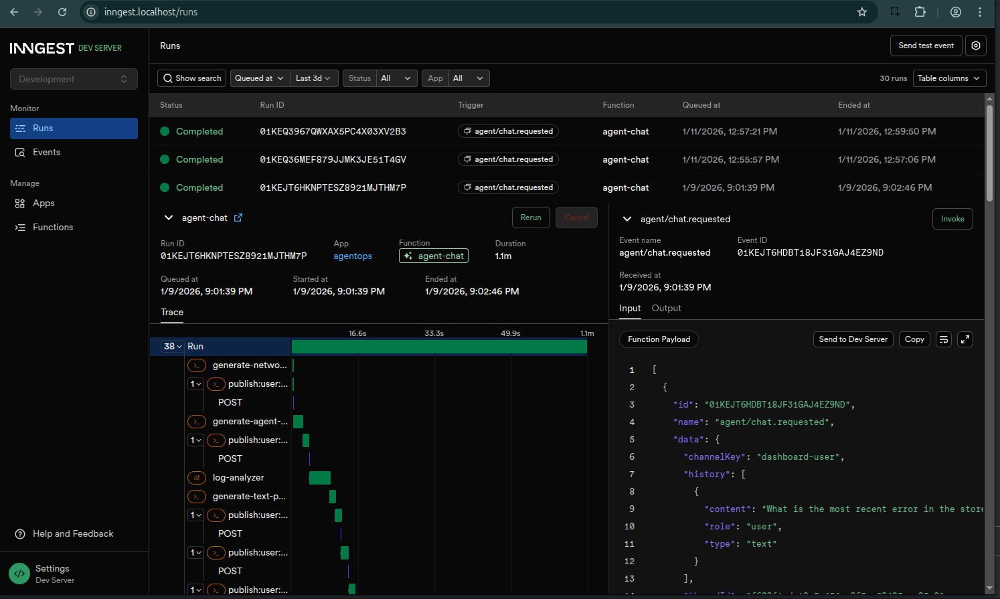

# AgentOps



**A proof-of-concept agent framework demonstrating durable AI agents with human-in-the-loop approval, built on Inngest AgentKit.**

This repository showcases architectural patterns for building autonomous agent systems that can pause for human approval and resume after server restarts. It's intended as a reference implementation and learning resource, not a production deployment.

## What This Demonstrates

This project illustrates key patterns for durable agent systems:

- **Human-in-the-Loop (HITL)** - Dangerous operations pause for human approval before executing
- **Durable Execution** - Inngest step functions provide automatic crash recovery
- **Multi-agent Orchestration** - LLM-based routing between specialized agents
- **Real-time Streaming** - Watch agent progress via WebSocket with `@inngest/use-agent`
- **Distributed Tracing** - OpenTelemetry integration with Tempo for observability

See [docs/AGENT_ARCHITECTURE.md](./docs/AGENT_ARCHITECTURE.md) for detailed architecture and patterns.

## Core Technologies

**Agent Framework**:
- [Inngest AgentKit](https://github.com/inngest/agent-kit) - Durable agent orchestration with step functions
- [Hono](https://hono.dev/) - Lightweight HTTP server
- [Anthropic Claude](https://anthropic.com/) - LLM for agent reasoning and routing
- [Zod](https://zod.dev/) - Schema validation

**Dashboard**:
- [React](https://react.dev/) - UI framework
- [@inngest/use-agent](https://www.npmjs.com/package/@inngest/use-agent) - Real-time streaming hook
- [Tailwind CSS](https://tailwindcss.com/) - Styling

**Infrastructure**:
- Docker Compose - Service orchestration
- PostgreSQL - Conversation history persistence
- Loki + Grafana - Log aggregation and visualization
- Tempo - Distributed tracing
- Traefik - Reverse proxy

## Sample Application

The repository includes a **distributed bookstore system** for testing agent capabilities:
- Store API (orders, catalog, inventory)
- Warehouse APIs (fulfillment, shipments)
- React UI (customer + admin interfaces)
- PostgreSQL databases
- Background jobs (health checks, reconciliation)

This application provides realistic complexity for testing agents: debugging TypeScript services, analyzing distributed logs, and troubleshooting distributed system issues.

See [BOOKSTORE_ARCHITECTURE.md](./BOOKSTORE_ARCHITECTURE.md) for details.

## Quick Start

### Prerequisites

- **Node.js 20+** - Runtime for TypeScript
- **Docker & Docker Compose** - Container orchestration
- **Anthropic API Key** - Get from [console.anthropic.com](https://console.anthropic.com/)

### Installation

```bash
# Clone repository
git clone https://github.com/yourusername/agentops.git
cd agentops

# Create environment file
cp .env.example .env

# Edit .env and set your Anthropic API key
nano .env  # Set ANTHROPIC_API_KEY=sk-ant-...
```

See comments in `.env.example` for variable descriptions.

### Start Services

**Option 1: Automated (Recommended)**
```bash
./scripts/start.sh --build
```

**Option 2: Manual**
```bash
# Install Docker Loki logging plugin
./scripts/setup-logging.sh

# Start all services
docker compose up --build
```

### Access the Dashboard

Open http://agents.localhost in your browser.

1. Enter a task (e.g., "The store-api is returning 500 errors. Fix it.")
2. Watch the agent investigate and propose solutions
3. Approve or reject dangerous operations (file writes, shell commands)

## Access Points

| Service | URL | Purpose |
|---------|-----|---------|
| Agent Dashboard | http://agents.localhost | Agent UI with approval flow |
| Inngest Dev UI | http://inngest.localhost | Function debugging, traces |
| Bookstore UI | http://localhost | Customer/admin interface |
| Store API | http://api.localhost/store | Orders and catalog |
| Warehouse Alpha | http://api.localhost/warehouses/alpha | Fulfillment |
| Warehouse Beta | http://api.localhost/warehouses/beta | Fulfillment |
| Grafana | http://grafana.localhost | Logs (Loki) and traces (Tempo) |
| Traefik Dashboard | http://localhost:8080 | Routing and services |
| Agent Server API | http://api.localhost/agents/api | Agent HTTP API |

**Test Credentials**:
- Customer: `alice@customer.com:alice123`
- Admin: `admin@bookstore.com:admin123`
- Warehouse Staff: `staff@warehouse-alpha.com:staff123`

## Example Tasks

**Orchestration Agent** (recommended):
- "The store-api is returning 500 errors. Fix it."
- "Debug the inventory sync job and check recent logs"
- "Fix the bug in auth service and verify no errors in logs"

**Coding Agent**:
- "Fix all TypeScript errors in ops/test-cases/"
- "Debug why the authentication module is failing"

**Log Analyzer Agent**:
- "Why is warehouse-alpha returning 500 errors?"
- "Show me all failed order processing attempts"

## Project Structure

```
agentops/
├── ops/                           # Agent framework
│   ├── src/                       # Agent server source
│   │   ├── server.ts              # Hono HTTP server
│   │   ├── network.ts             # AgentKit network + router
│   │   ├── agents/                # Agent definitions
│   │   ├── tools/                 # Tool implementations
│   │   ├── prompts/               # System prompts
│   │   └── db/                    # History persistence
│   └── dashboard/                 # React dashboard with approval UI
├── services/                      # Bookstore microservices
│   ├── store-api/                 # Store backend (TypeScript + Koa)
│   ├── warehouse-api/             # Warehouse backend (TypeScript + Koa)
│   └── bookstore-ui/              # React frontend
├── infra/                         # Infrastructure configs
│   ├── traefik/                   # Reverse proxy
│   ├── loki/                      # Log aggregation
│   ├── grafana/                   # Dashboards + datasources
│   └── tempo/                     # Distributed tracing
├── docs/                          # Documentation
│   ├── AGENT_ARCHITECTURE.md      # Agent framework details
│   └── assets/                    # Screenshots and diagrams
├── BOOKSTORE_ARCHITECTURE.md      # Sample app architecture
└── docker-compose.yaml            # Service orchestration
```

## Documentation

- **[Agent Architecture](./docs/AGENT_ARCHITECTURE.md)** - Framework design, patterns, and extensibility
- **[Bookstore Architecture](./BOOKSTORE_ARCHITECTURE.md)** - Sample application details
- **[Logging Guide](./docs/LOGGING.md)** - Log aggregation with Loki and Grafana

## Development

### Agent Development

```bash
cd ops
npm install              # Install dependencies
npm run build            # Build TypeScript
npm run dev:server       # Run agent server (port 3200)
npm run dev:dashboard    # Run dashboard (port 5173)
```

### Bookstore Development

```bash
# Rebuild specific service
docker compose up --build store-api

# Access database
docker compose exec store-db psql -U storeuser -d store_db

# View logs
docker compose logs -f store-api
```

## Proof of Concept Limitations

This is a reference implementation for learning and experimentation. It is **not intended for production use** and lacks:

- **Security hardening** - No HTTPS, no authentication on dashboard
- **Production Inngest** - Uses Inngest dev server (production requires Inngest Cloud)
- **Scalability** - Single-instance services, no horizontal scaling
- **Testing** - Minimal test coverage
- **Run history UI** - Historical run queries require Inngest dev UI or database access

If adapting this for real-world use, implement proper security, use Inngest Cloud, and add monitoring.

## License

MIT
