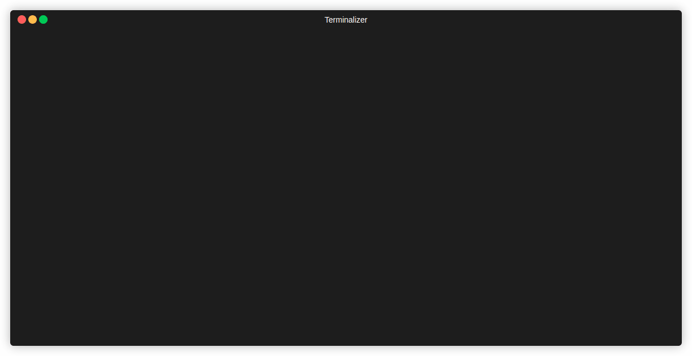

# AgentOps



**A proof-of-concept agent framework demonstrating autonomous AI systems that can debug code, analyze logs, and orchestrate operational tasks.**

This repository showcases architectural patterns and design principles for building multi-agent systems. It's intended as a reference implementation and learning resource, not a production deployment.

## What This Demonstrates

This project illustrates key patterns for autonomous agent systems:

- **Multi-agent orchestration** - Route tasks to specialized agents based on capabilities
- **Tool-based execution** - LLM agents with file system, shell, and query tools
- **Event-driven architecture** - Real-time streaming updates via Server-Sent Events
- **Client-server pattern** - HTTP API with interactive CLI interface

See [AGENT_ARCHITECTURE.md](./AGENT_ARCHITECTURE.md) for detailed architecture and patterns.

## Core Technologies

**Agent Framework**:
- [Vercel AI SDK](https://sdk.vercel.ai/) - LLM orchestration with tool calling
- [Hono](https://hono.dev/) - Lightweight HTTP server
- [Zod](https://zod.dev/) - Schema validation

**CLI Interface**:
- [Ink](https://github.com/vadimdemedes/ink) - React for terminal UIs
- [Commander](https://github.com/tj/commander.js) - CLI argument parsing

**Infrastructure**:
- Docker Compose - Service orchestration
- Loki + Grafana - Log aggregation and visualization
- Traefik - Reverse proxy

## Sample Application

The repository includes a **distributed bookstore system** for testing agent capabilities:
- Store API (orders, catalog, inventory)
- Warehouse APIs (fulfillment, shipments)
- React UI (customer + admin interfaces)
- PostgreSQL databases
- Background jobs (health checks, reconciliation)

This application provides realistic complexity for testing agents: debugging TypeScript services, analyzing distributed logs, and troubleshooting distributed system issues.

See [BOOKSTORE_ARCHITECTURE.md](./BOOKSTORE_ARCHITECTURE.md) for details.

## Quick Start

### Prerequisites

- **Node.js 20+** - Runtime for TypeScript
- **Docker & Docker Compose** - Container orchestration
- **Anthropic API Key** - Get from [console.anthropic.com](https://console.anthropic.com/)

### Installation

```bash
# Clone repository
git clone https://github.com/yourusername/agentops.git
cd agentops

# Create environment files
cp .env.example .env
cp ops/packages/agent-server/.env.example ops/packages/agent-server/.env

# Edit .env files and set your Anthropic API key
# The defaults work for everything except ANTHROPIC_API_KEY
nano ops/packages/agent-server/.env  # Set ANTHROPIC_API_KEY=sk-ant-...
nano .env                            # Review and adjust if needed
```

See comments in `.env` files for variable descriptions.

### Start Services

**Option 1: Automated (Recommended)**
```bash
./scripts/start.sh --build
```

**Option 2: Manual**
```bash
# Install Docker Loki logging plugin
./scripts/setup-logging.sh

# Start all services
docker compose up --build
```

### Start Agent CLI

```bash
cd ops
npm install
npm run build
npm run dev:cli
```

Then select an agent and provide a task:
- **Orchestration Agent** - Routes to specialized agents
- **Coding Agent** - Debug and fix code
- **Log Analyzer Agent** - Query and analyze logs

## Access Points

| Service | URL | Purpose |
|---------|-----|---------|
| Bookstore UI | http://localhost | Customer/admin interface |
| Store API | http://api.localhost/store | Orders and catalog |
| Warehouse Alpha | http://api.localhost/warehouses/alpha | Fulfillment |
| Warehouse Beta | http://api.localhost/warehouses/beta | Fulfillment |
| Grafana (Logs) | http://grafana.localhost | Log visualization |
| Loki | http://loki.localhost | Log aggregation |
| Traefik Dashboard | http://localhost:8080 | Routing and services |
| Agent Server API | http://api.localhost/agents | Agent HTTP API |

**Test Credentials**:
- Customer: `alice@customer.com:alice123`
- Admin: `admin@bookstore.com:admin123`
- Warehouse Staff: `staff@warehouse-alpha.com:staff123`

## Usage Examples

### Via CLI (Interactive)

```bash
cd ops
npm run dev:cli
```

Select agent → Enter task → Watch real-time execution

### Via API (Programmatic)

```bash
# Run coding agent
curl -X POST http://api.localhost/agents/coding/run \
  -u admin:admin123 \
  -H "Content-Type: application/json" \
  -d '{"task": "Fix TypeScript errors in test-cases/app.ts", "config": {"maxSteps": 10}}'

# Run log analyzer
curl -X POST http://api.localhost/agents/log-analyzer/run \
  -u admin:admin123 \
  -H "Content-Type: application/json" \
  -d '{"task": "Find errors in store-api from the last hour"}'
```

### Example Tasks

**Coding Agent**:
- "Fix all TypeScript errors in ops/test-cases/"
- "Debug why the authentication module is failing"
- "Run the test suite and fix any failures"

**Log Analyzer Agent**:
- "Why is warehouse-alpha returning 500 errors?"
- "Show me all failed order processing attempts"
- "Analyze the last 10 minutes of store-api logs"

**Orchestration Agent**:
- "Fix the bug in auth service and verify no errors in logs"
- "Debug the inventory sync job and check recent logs"

## Project Structure

```
agentops/
├── ops/                           # Agent framework (monorepo)
│   ├── packages/
│   │   ├── agent-server/          # Hono HTTP server + agents
│   │   ├── ops-cli/               # Interactive CLI client
│   │   └── shared/                # Common types and utilities
│   └── test-cases/                # Sample code for testing agents
├── services/                      # Bookstore microservices
│   ├── store-api/                 # Store backend (TypeScript + Koa)
│   ├── warehouse-api/             # Warehouse backend (TypeScript + Koa)
│   └── bookstore-ui/              # React frontend
├── infra/                         # Infrastructure configs
│   ├── traefik/                   # Reverse proxy
│   ├── loki/                      # Log aggregation
│   └── grafana/                   # Log visualization
├── AGENT_ARCHITECTURE.md          # Agent framework details
├── BOOKSTORE_ARCHITECTURE.md      # Sample app architecture
└── docker-compose.yaml            # Service orchestration
```

## Documentation

- **[Agent Architecture](./AGENT_ARCHITECTURE.md)** - Framework design, patterns, and extensibility
- **[Bookstore Architecture](./BOOKSTORE_ARCHITECTURE.md)** - Sample application details
- **[User Guide](./docs/USER_GUIDE.md)** - Using the bookstore application
- **[Logging Guide](./docs/LOGGING.md)** - Log aggregation with Loki and Grafana

## Development

### Agent Development

```bash
cd ops
npm install              # Install dependencies
npm run build           # Build all packages
npm run dev:server      # Run agent server (port 3200)
npm run dev:cli         # Run CLI client (in another terminal)
```

### Bookstore Development

```bash
# Rebuild specific service
docker compose up --build store-api

# Access database
docker compose exec store-db psql -U storeuser -d store_db

# View logs
docker compose logs -f store-api
```

## Proof of Concept Limitations

This is a reference implementation for learning and experimentation. It is **not intended for production use** and lacks:

- **Security hardening** - No HTTPS, uses basic auth, shared secrets in env vars
- **Error recovery** - Limited retry logic and failure handling
- **Scalability** - Single-instance services, no horizontal scaling
- **Monitoring** - Basic logging only, no metrics or alerting
- **Testing** - Minimal test coverage
- **Authentication** - Simple auth suitable for demos only

If adapting this for real-world use, implement proper security, observability, and reliability patterns.

## License

MIT
